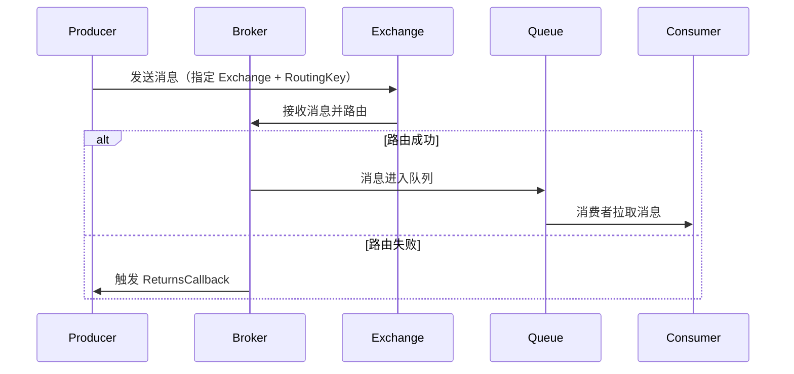
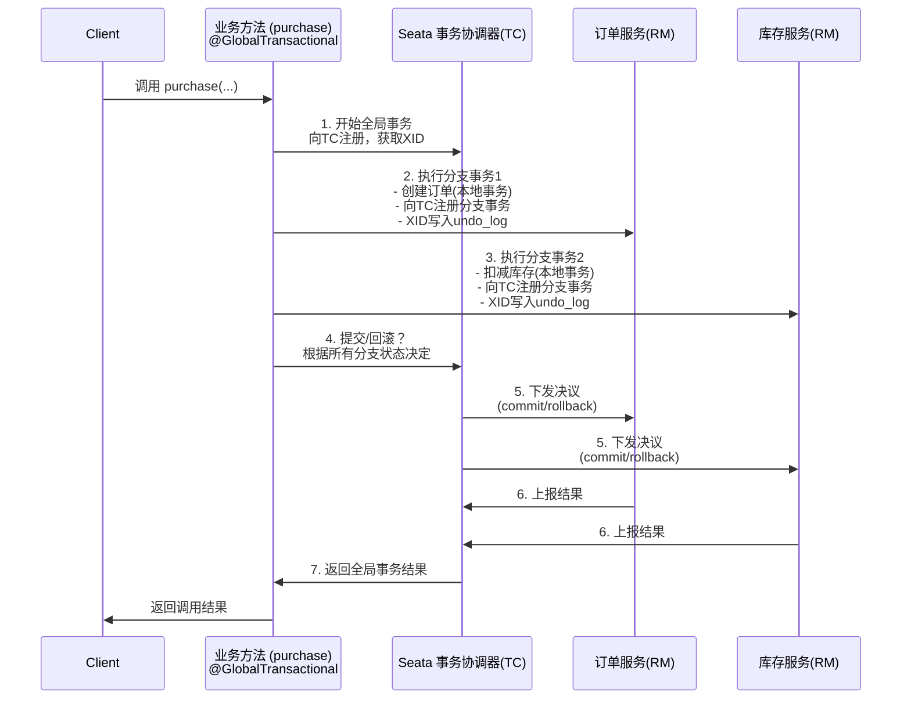

https://www.yuque.com/zhangshuaiyin/guli-mall

https://www.yuque.com/mo_ming/gl7b70/azodep

# Nignx

#### Round Robin

- **How it works**: The Round Robin method distributes client requests across the servers in a sequential manner. Each server gets an equal number of requests by taking turns in a circular order.
- **Advantages**: Simple to implement, good for systems where all servers have similar capacities.
- **Disadvantages**: It does not account for differences in server performance or load, which can lead to inefficiencies if some servers are slower or have more resources than others.

#### Least Connections

- **How it works**: restfultoolkitThe Least Connections strategy sends incoming requests to the server with the fewest active connections. This helps balance the load dynamically based on the actual server load at any given time.
- **Advantages**: Better for environments where connections are long-lived or servers have varying processing capacities.
- **Disadvantages**: Requires tracking active connections, which adds a bit of overhead compared to Round Robin.

#### IP Hash (Source-based Hashing)

- **How it works**: In the IP Hash strategy, the client’s IP address is used to generate a hash, which determines which server will handle the request. This ensures that requests from the same client are consistently routed to the same server.
- **Advantages**: Useful for scenarios where session persistence is important, such as with stateful applications.
- **Disadvantages**: Can lead to unbalanced loads if the client distribution is uneven, and it doesn’t adapt well to servers with varying capabilities.

### Service registration/discovery

when server1 with service B go online->tell nacos-> register

discovery: go nacos, then discover sevice is in server1, server2

### Nacos (Naming Configuration Service)

**service discovery, configuration management, and dynamic DNS** for microservices architectures

supporting both APIs and gRPC for service interaction.

### gRPC

 high-performance, open-source framework developed by Google for **remote procedure calls (RPCs)**

gRPC uses **Protocol Buffers (Protobuf)**, a binary serialization format, for defining service methods and data types, making it more efficient than traditional text-based formats like JSON or XML.

### Configuration Center

get configuration from center (ato configuration)

### Circuit Breaking & Service Downgrading

Breaking: Like a circuit breaker in an electrical system, it temporarily blocks requests to a failing service to prevent overloading. When the service recovers, the circuit breaker "closes" and resumes traffic.

Downgrading: When a service is overloaded or fails, the system reduces its level of service by providing fallback responses, default results, or limiting features to maintain availability.

简单说失败达到阈值，融断，直接不调用这个服务

降级：高峰期，系统资源紧张，非核心服务降级，比如throw exception， return null，mock数据，fallback处理逻辑

### API gateway

all request -> gateway -> final service request!

# IDEA plug

```
restfultoolkit
jrebel
lombok
Mybatis
```

# Redis & Mysql

spring Cloud 微服务

分布式：不同业务不同地方

集群：几台服务器实现同一业务

rpc ->Spring Cloud 中使用HTTP+JSON完成远程调用（不同服务存在不同主机里，服务之间互相调用）

### docker install mysql

```sql
ALTER USER 'root'@'localhost' IDENTIFIED BY '0602';
FLUSH PRIVILEGES;
exit;
```

```shell
(base) ➜  ~ sudo docker pull mysql
(base) ➜  ~ mkdir -p ~/mydata/mysql/log ~/mydata/mysql/data ~/mydata/mysql/conf
(base) ➜  ~ sudo docker run -p 3307:3306 --name docker_mysql \
-v ~/mydata/mysql/log:/var/log/mysql \
-v ~/mydata/mysql/data:/var/lib/mysql \
-v ~/mydata/mysql/conf:/etc/mysql/conf.d \
-e MYSQL_ROOT_PASSWORD=0602 \
-d mysql:latest
(base) ➜  ~ docker ps
```

```shell
cd /mydata/mysql/conf
vi my.cnf

[client]
default-character-set=utf8
[mysql]
default-character-set=utf8
[mysqld]
init_connect='SET collation_connection = utf8_unicode_ci'
init_connect='SET NAMES utf8'
character-set-server=utf8
collation-server=utf8_unicode_ci
#skip-character-set-client-handshake
skip-name-resolve

docker restart mysql
```

hosts 3307 will map to docker 3306, so we can visit host 3307 to visit 3306.

`mysql -u root -p -h 127.0.0.1 -P 3307`

`show tables;`

它给的sql创建文件有问题，要手动加上，不然datagrip会报错（不能用ssh连接docker里的mysql）

```sqlite
CREATE DATABASE /*!32312 IF NOT EXISTS*/`gulimall_ums` /*!40100 DEFAULT CHARACTER SET utf8mb4 */;

USE `gulimall_ums`;
```

`MYSQL_ROOT_PASSWORD` set password as `root`

### docker install redis

```shell
(base) ➜  ~ docker pull redis
(base) ➜  ~ mkdir -p ~/mydata/redis/conf
(base) ➜  ~ touch ~/mydata/redis/conf/redis.conf
(base) ➜  ~ echo "appendonly yes"  >> ~/mydata/redis/conf/redis.conf # for serialize
(base) ➜  ~ docker run -p 6380:6379 --name docker_redis \
-v ~/mydata/redis/data:/data \
-v ~/mydata/redis/conf/redis.conf:/etc/redis/redis.conf \
-d redis redis-server /etc/redis/redis.conf
```

```shell
# mysql
docker update docker_mysql --restart=always
# redis
docker update docker_redis --restart=always
```

两个必要组键

* **Spring Web**
* **OpenFeign**

然后聚合，把不同微服务合在一起

```xml
    <modules>
        <module>gulimall-coupon</module>
        <module>gulimall-member</module>
        <module>gulimall-order</module>
        <module>gulimall-product</module>
        <module>gulimall-ware</module>
    </modules>
```

`.gitignore`

```
**/mvnw
**/mvnw.cmd

**/.mvn
**/target/

.idea
```

# renren opensource(Backend and Frontend)

https://gitee.com/renrenio

renren-fast is backend adminstration system (this is based on springboot 2.6.6, and not 3.X.X, so need old version java 17)

renren-generator 

renren-fast-vue

use jdk 17 and change lomlock version to `<lombok.version>1.18.30</lombok.version>`

```shell
sudo update-alternatives --config java
vim ~/.zshrc
#change $JAVA_HOME
source ~/.zshrc
```

frontend use nvm manage node version!

```shell
(base) ➜  ~ node --version
v14.21.3
```

use the mysql.sql script in renren-fast/db to build admin database

then modify resource/application_dev.yml for jdbc connection

## renren fast

nvm install 14!

```
npm install node-sass@npm:sass --ignore-scripts
npm run dev
```

# generator

```yml
erver:
  port: 30080

# mysql
spring:
  datasource:
    type: com.alibaba.druid.pool.DruidDataSource
    #MySQL配置
    driverClassName: com.mysql.cj.jdbc.Driver
   	url: jdbc:mysql://localhost:3307/gulimall_pms?useUnicode=true&characterEncoding=UTF-8&serverTimezone=America/Chicago
    username: root
    password: "0602"
```

`geenrator.properties`

```properties
#\u4EE3\u7801\u751F\u6210\u5668\uFF0C\u914D\u7F6E\u4FE1\u606F

mainPath=com.hychen11
#\u5305\u540D
package=com.hychen11.gulimall
moduleName=product
#\u4F5C\u8005
author=hychen
#Email
email=zjuchy1@gmail.com
#\u8868\u524D\u7F00(\u7C7B\u540D\u4E0D\u4F1A\u5305\u542B\u8868\u524D\u7F00)
tablePrefix=pms_
```

Copy main into dir

template controller delete `RequiresPermissions`

# gulimall-common

because generator has many DAO,DTO,entity  error, so need to create a class, that contains these class

so add pom.xml (product)

```xml
 <dependency>
      <groupId>com.hychen11</groupId>
      <artifactId>common</artifactId>
      <version>0.0.1-SNAPSHOT</version>
  </dependency>
```


```java
/**
 * 1、整合MyBatis-Plus
 *      1）、导入依赖
 *     <dependency>
            <groupId>com.baomidou</groupId>
            <artifactId>mybatis-plus-boot-starter</artifactId>
            <version>3.5.10.1</version>
        </dependency>
 *      2）、配置
 *          1、配置数据源；
 *              1）、导入数据库的驱动。https://dev.mysql.com/doc/connector-j/8.0/en/connector-j-versions.html
 *              2）、在application.yml配置数据源相关信息
 *          2、配置MyBatis-Plus；
 *              1）、使用@MapperScan
 *              2）、告诉MyBatis-Plus，sql映射文件位置
 *
 * 2、逻辑删除
 *  1）、配置全局的逻辑删除规则（省略）
 *  2）、配置逻辑删除的组件Bean（省略）
 *  3）、给Bean加上逻辑删除注解@TableLogic
 *
 * 3、JSR303
 *   1）、给Bean添加校验注解:javax.validation.constraints，并定义自己的message提示
 *   2)、开启校验功能@Valid
 *      效果：校验错误以后会有默认的响应；
 *   3）、给校验的bean后紧跟一个BindingResult，就可以获取到校验的结果
 *   4）、分组校验（多场景的复杂校验）
 *         1)、	@NotBlank(message = "品牌名必须提交",groups = {AddGroup.class,UpdateGroup.class})
 *          给校验注解标注什么情况需要进行校验
 *         2）、@Validated({AddGroup.class})
 *         3)、默认没有指定分组的校验注解@NotBlank，在分组校验情况@Validated({AddGroup.class})下不生效，只会在@Validated生效；
 *
 *   5）、自定义校验
 *      1）、编写一个自定义的校验注解
 *      2）、编写一个自定义的校验器 ConstraintValidator
 *      3）、关联自定义的校验器和自定义的校验注解
 *
 * 4、统一的异常处理
 * @ControllerAdvice
 *  1）、编写异常处理类，使用@ControllerAdvice。
 *  2）、使用@ExceptionHandler标注方法可以处理的异常。
 */
```

step1 导入依赖

加入utils 的`Constant`，`PageUtils`，`Query`，`R`和xss `SQLFilter`

相当于补全报错

然后pom.xml加入dependency

```xml
		<!--mybatis plus-->
		<dependency>
			<groupId>com.baomidou</groupId>
			<artifactId>mybatis-plus-boot-starter</artifactId>
			<version>3.2.0</version>
		</dependency>

		<dependency>
			<groupId>org.projectlombok</groupId>
			<artifactId>lombok</artifactId>
			<version>1.18.8</version>
		</dependency>
 
    <dependency>
			<groupId>org.apache.httpcomponents</groupId>
			<artifactId>httpcore</artifactId>
			<version>4.4.16</version>
			<scope>compile</scope>
		</dependency>
```

step2.1 配置数据源

导入数据库驱动

```xml
<!--		import mysql-->
		<dependency>
			<groupId>mysql</groupId>
			<artifactId>mysql-connector-java</artifactId>
			<version>8.0.30</version>
		</dependency>
		<dependency>
			<groupId>javax.servlet</groupId>
			<artifactId>servlet-api</artifactId>
			<version>2.3</version>
			<scope>provided</scope>
		</dependency>
```

在application.yml里配置数据源，表述数据操作到哪个表里

```yml
spring:
  datasource:
    driverClassName: com.mysql.cj.jdbc.Driver
    url: jdbc:mysql://localhost:3307/gulimall_pms?useUnicode=true&characterEncoding=UTF-8&serverTimezone=America/Chicago
    username: root
    password: "root"
```

step2.2 配置Mybatis-plus

使用@MapperScan

在启动项加上

```java
import org.mybatis.spring.annotation.MapperScan;
@SpringBootApplication
@MapperScan("com.hychen11.gulimall.product.dao")
```

MapperPath

告诉MyBatis-Plus，sql映射文件位置

```yml
mybatis-plus:
  mapper-locations: classpath:/mapper/**/*.xml
  global-config:
    db-config:
      id-type: auto
```

entity上有`@TableId`表示这个是主键，`auto`表示自增主键 

mysql的索引是b+树结构，如果用uuid b+树结构会不停变化很消耗资源，一般都是自增

然后运行报错`java.lang.IllegalStateException: Failed to load ApplicationContext`

mvn idea:module 命令执行完毕后生成iml文件，再次点击maven build工程顺利编译通过

### 设定端口

```yml
server:
	port:7000
```

coupon: 7000

member: 8000

order: 9000

product: 10000

ware: 11000

# SpringCloud

register center

config center

gateway


SpringCloud Alibaba Nacos: Register center, Config center

SpringCloud Ribbon (load balance) 

SpringCloud Feign: RPC

**SpringCloud Alibaba Sentinel** (Fault Tolerance, Rate Limiting or Throttling, Graceful Degradation or Fallback, Circuit Breaker) 服务容错限流降级融断

SpringCloud gateway API gateway webflux

SpringCloud Sleuth

SpringCloud Alibaba -seata (Fescar)

### SpringCloud Alibaba version

springboot version 2.6.6, jdk17.

gulimall-common `pom.xml`

```xml
<dependencies>
    <dependency>
        <groupId>com.alibaba.cloud</groupId>
        <artifactId>spring-cloud-alibaba-dependencies</artifactId>
        <version>2021.0.1.0</version>
        <type>pom</type>
        <scope>import</scope>
    </dependency>
</dependencies>
```

**2021.x branch**: Corresponds to Spring Cloud 2021 & Spring Boot 2.6.x. JDK 1.8 or later versions are supported.

### Nacos register

download nacos https://github.com/alibaba/nacos/releases

https://github.com/alibaba/spring-cloud-alibaba/blob/2023.x/spring-cloud-alibaba-examples/nacos-example/readme.md

#### docker Nacos

```shell
(base) ➜  ~ docker run --name nacos1 -d -p 8848:8848 \                  
--restart=always \
-e JVM_XMS=512m \
-e JVM_XMX=2048m \
-e MODE=standalone \
-e PREFER_HOST_MODE=hostname \
-v ~/nacos-logs:/home/nacos/logs \    
nacos/nacos-server:latest
```


**服务注册发现**也放gulimall-common pom.xml里

Before launching the Nacos Discovery sample for demonstration, take a look at how Spring Cloud applications access Nacos Discovery.

**Note that this section is only for your convenience to understand the access method. The access work has been completed in this sample code, and you do not need to modify it.**

1. First, modify the `pom.xml` file and introduce spring-cloud-alibaba-nacos-discovery-starter;

   ```xml
   <dependency>
       <groupId>com.alibaba.cloud</groupId>
       <artifactId>spring-cloud-starter-alibaba-nacos-discovery</artifactId>
   </dependency>
   ```

2. Configuring a Nacos Server address in an `/src/main/resources/application.properties` applied configuration file;

   ```properties
   spring.cloud.nacos.discovery.server-addr=127.0.0.1:8848
   spring.application.name: gulimall-XXX
   #注意这里nacos 2.5要带上username, password, default is nacos/nacos
   
     cloud:
       nacos:
         discovery:
           server-addr: localhost:8848
           username: nacos
           password: "nacos"
     application:
       name: product
   ```

3. Use `@ EnableDiscoveryClient` annotation to enable service registration and discovery;

   ```java
   @SpringBootApplication
   @EnableDiscoveryClient
   public class ProviderApplication {
   
       public static void main(String[] args) {
           SpringApplication.run(ProviderApplication.class, args);
       }
   
       @RestController
       class EchoController {
           @GetMapping(value = "/echo/{string}")
           public String echo(@PathVariable String string) {
                   return string;
           }
       }
   }
   ```

```
cd nacos/bin
bash startup.sh -m standalone
```

`-m standalone` means Singleton Pattern

check `localhost:8848/nacos`

self-start

```shell
sudo nano /etc/systemd/system/nacos.service


[Unit]
Description=Nacos Server
After=network.target

[Service]
Environment="JAVA_HOME=/usr/lib/jvm/java-17-openjdk-amd64/bin/java"
Type=forking
ExecStart=/opt/nacos/bin/startup.sh -m standalone
ExecStop=/opt/nacos/bin/shutdown.sh
Restart=on-failure
LimitNOFILE=65535
PrivateTmp=true
[Install]
WantedBy=multi-user.target


sudo systemctl daemon-reload 
systemctl start nacos
systemctl status nacos
systemctl stop nacos
systemctl enable nacos
systemctl is-enabled nacos
```

简单说就是**加依赖**，**加注解`@EnableDiscoveryClient`**，**加application.yml**

> 用于在 Spring Cloud 项目中启用服务注册和发现功能。它的主要作用是使应用程序能够注册到服务注册中心（比如 Eureka、Consul 或 Zookeeper），从而实现微服务的自动发现和负载均衡等功能。
>
> “注册到 Eureka”指的是当一个微服务启动时，它会自动将自己的信息（如服务名称、IP 地址、端口号等）发送到 Eureka 服务器（也就是注册中心）。这样，Eureka 注册中心就会记录下该服务的实例信息，以便其他服务可以通过 Eureka 发现并调用它。

### Feign

> **Process: service A want call service B, then visit nacos find B on machine1,2,3, return one machine to service A, then it can call**

Feign is Declarative HTTP Client

Feign 允许开发者定义接口，并通过注解方式指定接口方法要请求的 HTTP 路径、参数等。Feign 会根据接口和注解自动生成对应的 HTTP 请求逻辑，并通过注册中心查找服务地址，简化了服务调用。

**声明式接口**：你只需定义一个 Java 接口，并用注解来描述 HTTP 请求的细节，比如 `@GetMapping`、`@PostMapping` 等。

**自动代理**：Feign 会在运行时创建接口的代理，实现远程调用。通过代理对象，Feign 会自动生成 HTTP 请求，发送到目标服务，并将返回结果映射为 Java 对象。

**负载均衡**：结合 Eureka 和 **Ribbon**（已内置在 Spring Cloud Feign 中），Feign 支持客户端负载均衡，可以自动选择一个可用的实例来发送请求。

有一个 `UserService`，另一个服务 `OrderService` 想调用它的 `/user/info` 接口。可以这样定义 Feign 客户端接口：

`@FeignClient(name = "coupon", url ="http://localhost:7000")`如果未指定 url，会根据 name 在 Eureka/Nacos 等注册中心寻找 coupon 服务

```java
import org.springframework.cloud.openfeign.FeignClient;
import org.springframework.web.bind.annotation.GetMapping;
import org.springframework.web.bind.annotation.RequestParam;

@FeignClient(name = "UserService")  // 表示调用的服务名
public interface UserClient {

    @GetMapping("/user/info")  // 定义请求路径
    UserInfo getUserInfo(@RequestParam("id") Long userId);
}
```

在 `OrderService` 中注入 `UserClient` 接口后，就可以像调用本地方法一样调用 `getUserInfo` 方法，而 Feign 会自动发出 HTTP 请求到 `UserService` 的 `/user/info`

#### openfeign

```java
/*
    1）include openfeign
    2）interface, tell springcloud this interface needs rpc
    3) open rpc (@EnableFeignClients)
*/
```

1） 在创建module里就勾了springweb+openfeign

```xml
       <dependency>
            <groupId>org.springframework.boot</groupId>
            <artifactId>spring-boot-starter-web</artifactId>
        </dependency>
        <dependency>
            <groupId>org.springframework.cloud</groupId>
            <artifactId>spring-cloud-starter-openfeign</artifactId>
        </dependency>
```

2）创建一个feign的package，创建 的Interface

```java
package com.hychen11.gulimall.member.feign;

import com.hychen11.gulimall.common.utils.R;
import org.springframework.cloud.openfeign.FeignClient;
import org.springframework.web.bind.annotation.GetMapping;

@FeignClient(name="coupon",url = "http://localhost:7000")
public interface CouponFeignService {
    @GetMapping("/coupon/coupon/member/list")
    public R memberCoupons();
}
```

注意，这里的R class相当与把数据Map成JSON格式，然后返回给客户端

如果调用接口的`memberCoupons()`,去注册中心找`coupon`，然后调用请求`/coupon/coupon/member/list`

3）Main Application Class add @EnableFeignClients

```java
@EnableFeignClients(basePackages = "com.hychen11.gulimall.member.feign")
```

启动时会自动扫描这个路径下的所有标了`@FeignClient` annotation的 Interface

> 回顾一下feign的调用流程，假设service A，service B, A 有funcA，B想调用A的funcA
>
> Step1 B创建feign package，然后在Application加上`@EnableFeignClients(basePackages="")`在启动时可以读取到feign包的内容
>
> Step2 B的feign package里有AFeignService interface，里面函数就是直接copy A的funcA，然后还要在头上加上`@FeignClient(A)` 为了去nacos找到service A的machine地址然后通过http发送请求得到回复，然后这里的`RequestMapping` 要包含完整路径
>
> Step3 注入AFeignService，调用函数
>
> ```
> Service B 调用 AFeignService.funcA()
> → Feign 代理 HTTP 请求
> → Nacos 获取 Service A 地址
> → 发送 HTTP 请求到 Service A
> → Service A 处理并返回数据
> → Feign 解析 JSON，返回 Java 对象
> ```

### Nacos config

step1 配置中心做配置管理

add into gulimall-common pom.xml

```xml
<dependency>
    <groupId>com.alibaba.cloud</groupId>
    <artifactId>spring-cloud-starter-alibaba-nacos-config</artifactId>
</dependency>
<dependency>
    <groupId>org.springframework.cloud</groupId>
    <artifactId>spring-cloud-starter-bootstrap</artifactId>
    <version>3.0.2</version>
</dependency>
```

step2

创建`bootstrap.properties`

```properties
spring.application.name=gulimall-coupon
spring.cloud.nacos.config.server-addr=127.0.0.1:8848
```

step3

`application.properties`适用于静态值的读取

```
coupons.user.name="b"
```

 ```java
 @Value("${coupons.user.name}")
 private String name;
 ```

step4

动态更新 在nacos里的Edit Configuration里properties添加

这里在controller.java里加上动态刷新的annotation

```java
@RefreshScope
```

step5

这里不能刷新，在application.yml里加上，nacos上也要在`gulimall-coupon.properties`这里加上配置

```yml
  cloud:
    nacos:
      serverAddr: 127.0.0.1:8848
      config:
        preference: remote
      discovery:
        server-addr: localhost:8848

  config:
    import:
      - nacos:gulimall-coupon.properties?refreshEnabled=true&group=DEFAULT_GROUP
```

### Namespace

default is in public

We can also have (every microserver create their own namespace (ioslation))

in application.yml add  `namespace: 6b8fe1af-0411-4ca5-a000-eef67eafc137` and ` group: coupon`

```yml
  cloud:
    nacos:
      serverAddr: 127.0.0.1:8848
      namespace: 6b8fe1af-0411-4ca5-a000-eef67eafc137
      group: coupon
      config:
        preference: remote
      discovery:
        server-addr: localhost:8848
```

# Gateway

nginx is one kind of gateway

> Nginx 本质上是一个**高性能的 HTTP 服务器和反向代理**，而 API Gateway 是一种专门针对**微服务架构**的网关解决方案

Client -> **API-service(gateway)**->{user-service,good-service,...}

Zuui RPS(20000), SpringCloud gateway RPS(30000)

### Features

Spring Cloud Gateway features:

- Built on Spring Framework and Spring Boot
- Able to match routes on any request attribute.
- Predicates and filters are specific to routes.
- Circuit Breaker integration.
- Spring Cloud DiscoveryClient integration
- Easy to write **Predicates and Filters**
- **Request Rate Limiting**
- Path Rewriting

URL(Uniform Resource Locator) and URI(Uniform Resource Identifier)

uri身份证号 url地址定位+身份证

### Glossary

- **Route**: The basic building block of the gateway. It is defined by an ID, a destination URI, a collection of predicates, and a collection of filters. **A route is matched if the aggregate predicate is true.**

- **Predicate**: This is a [Java 8 Function Predicate](https://docs.oracle.com/javase/8/docs/api/java/util/function/Predicate.html). The input type is a [Spring Framework `ServerWebExchange`](https://docs.spring.io/spring/docs/5.0.x/javadoc-api/org/springframework/web/server/ServerWebExchange.html). This lets you match on anything from the HTTP request, such as headers or parameters.

  > whether Routing and Forwarding needs condition judge (Predicate)

- **Filter**: These are instances of [`GatewayFilter`](https://github.com/spring-cloud/spring-cloud-gateway/blob/main/spring-cloud-gateway-server/src/main/java/org/springframework/cloud/gateway/filter/GatewayFilter.java) that have been constructed with a specific factory. Here, you can modify **requests and responses** before or after sending the downstream request.

  > filter 

**断言是用来匹配的,匹配成功就发送请求,fileter是拦截请求的**

我们可以定义一个过滤器来拦截所有来源IP不在白名单中的请求，或者对所有请求进行日志记录，并根据请求中携带的自定义标记进行不同的服务映射

Whitelist是一组被授权或允许访问的资源或服务的 IP 地址或用户列表


Clients make requests to Spring Cloud Gateway. If the Gateway Handler Mapping determines that a request matches a route, it is sent to the Gateway Web Handler. This handler runs the request through a filter chain that is specific to the request. The reason the filters are divided by the dotted line is that filters can run logic both before and after the proxy request is sent. All “pre” filter logic is executed. Then the proxy request is made. After the proxy request is made, the “post” filter logic is run.

URIs defined in routes without a port get default port values of **80 and 443 for the HTTP and HTTPS** URIs, respectively.

https://docs.spring.io/spring-cloud-gateway/reference/spring-cloud-gateway/request-predicates-factories.html

step1）开启服务注册发现`@EnableDiscoveryClient`

因为引入了common，里面有mybatis的操作，需要有数据源，但是这里用不到，就直接排除

`@SpringBootApplication(exclude = {DataSourceAutoConfiguration.class})`

**`bootstrap.properties`**最早加载，初始化springcloud组件

```properties
spring.application.name = gateway
spring.cloud.nacos.config.server-addr = 127.0.0.1:8848
spring.cloud.nacos.discovery.namespace = 41e93e2f-de27-4db9-80b9-8ae0fc7e3634
```

`application.properties` 后加载读取

```yml
spring.application.name=gateway
spring.cloud.nacos.discovery.server-addr=127.0.0.1:8848
server.port= 12000
```

Netty started on port 12000

Query注意这里要 `http://localhost:12000/?url=google` 这里`?`才是query！才能被perdicate

`？`前的是查询的地址，比如`http://localhost:12000/hello?url=google`就是查询`https://www.google.com/hello`

```yml
spring:
  cloud:
    gateway:
      routes:
        - id: test_route
          uri: https://www.google.com
          predicates:
            - Query=url,google
        - id: baidu_route
          uri: https://www.baidu.com
          predicates:
            - Query=url,baidu
```

# Dubbo

**服务暴露**：服务提供者（Provider）将服务接口暴露出去，并注册到注册中心，注册中心会记录该服务的信息（如 IP、端口）。

**服务引用**：服务消费者（Consumer）从注册中心获取服务地址，并通过 Dubbo 生成的代理类发起 RPC 请求调用服务提供者的方法。

**调用链路**：Dubbo 会根据注册中心的信息、负载均衡策略，将调用请求转发到合适的服务实例，实现了客户端和服务端的解耦。

```java
// 服务接口定义
public interface HelloService {
    String sayHello(String name);
}

// 服务实现
public class HelloServiceImpl implements HelloService {
    public String sayHello(String name) {
        return "Hello " + name;
    }
}
```

```
<!-- 服务提供者的配置 -->
<dubbo:application name="provider-app" />
<dubbo:registry address="zookeeper://localhost:2181" />
<dubbo:protocol name="dubbo" port="20880" />
<dubbo:service interface="com.example.HelloService" ref="helloService" />

<bean id="helloService" class="com.example.HelloServiceImpl" />
```

```
<!-- 服务消费者的配置 -->
<dubbo:application name="consumer-app" />
<dubbo:registry address="zookeeper://localhost:2181" />
<dubbo:reference id="helloService" interface="com.example.HelloService" />

// 使用服务
HelloService helloService = (HelloService) context.getBean("helloService");
String result = helloService.sayHello("Dubbo");
```

# 三级API 2.14

`protected`

**同一个类（自身）**

**同一个包（package）内的所有类**

**不同包的子类（`extends`）**

```java
public class CategoryServiceImpl extends ServiceImpl<CategoryDao, CategoryEntity> implements CategoryService {}
//这里Dao和Entity被封装在ServiceImpl的M和T里
//或者直接@Autowire注入
```

## Stream & Filter & Collect

stream可以处理数据集合

`filter()` 是 **Stream** 的 **中间操作**，用于**筛选元素**，保留满足条件的元素，丢弃不符合条件的

`filter()` 方法接受一个 **Lambda 表达式**，该表达式返回 `true` 表示保留元素，返回 `false` 表示丢弃

`.collect(Collectors.toList())`：将流的结果收集为 `List`

` .map(String::toUpperCase)` 

```java
List<CategoryEntity> collect = categoryEntities.stream().filter((entity) -> {
    return entity.getParentCid() == 0;
}).collect(Collectors.toList());
```

## Lambda

```java
(parameters) -> expression
(parameters) -> { statements; } //(parameters) -> { return expression; }
```

parameters可为空

## `@TableField`

**映射 Java 类的字段到数据库表的列**，可以控制字段与数据库表的关系，例如：

- 指定表字段名称
- 处理数据库中不存在的字段
- 处理数据库中的额外字段
- 忽略某些字段

```java
	//在CategoryEntity里加入
	@TableField(exist = false)
	private List<CategoryEntity> child;
```

## recursive search

```java
private List<CategoryEntity> getChild(CategoryEntity root, List<CategoryEntity> all) {
    List<CategoryEntity> collect = all.stream()
            .filter(entity -> entity.getParentCid() == root.getCatId())
            .map(menu -> {menu.setChild(getChild(menu, all)); return menu;})
            .collect(Collectors.toList());
    return collect;
}
```

核心逻辑就是这里的root父级，child级，filter出所有patentid==catid的entities，然后再getChild，用map设置child

## config vue template

添加一级菜单和二级菜单，我们设置的url `product/category`这里router显示规则是`product-category`

`views/modules/sys/`里有sys-role页面，那么就创建`views/modules/product/category.vue`

install plugins `Vetur` , vue template https://www.cnblogs.com/songjilong/p/12635448.html

## 配置网关与路由重写!!

```vue
this.$http({
  url: this.$http.adornUrl("/product/category/list/tree"),
  method: "get",
}).then((data)=>{});
```

这里需要访问 `http://localhost:10000/product/category/list/tree`

也就是`index.js`里

```js
/**
 * 开发环境
 */
;(function () {
  window.SITE_CONFIG = {};

  // api接口请求地址
  window.SITE_CONFIG['baseUrl'] = 'http://localhost:12000/api';

  // cdn地址 = 域名 + 版本号
  window.SITE_CONFIG['domain']  = './'; // 域名
  window.SITE_CONFIG['version'] = '';   // 版本号(年月日时分)
  window.SITE_CONFIG['cdnUrl']  = window.SITE_CONFIG.domain + window.SITE_CONFIG.version;
})();
```

发送到网关，renren-fast发送验证码，也要**加入nacos**

gateway的application.yml里加入

```yml
- id: admin_route
  uri: lb://renren-fast
  ## lb is load balance，使用loadbalance，并且把请求转发到renren-fast服务
  ## lb:// 表示这是一个通过注册中心（如 Nacos、Eureka）进行服务发现的负载均衡调用
  predicates:
    ## 前端项目发送请求，带有/api前缀
    - Path=/api/**
  filters:
  	- RewritePath=/api/(?<segment>.*),/renren-fast/$\{segment}
  	## 将api前缀替换为renren-fast前缀
```

`uri: lb://renren-fast` 就是请求来了，先去nacos里找renren-fast到服务，发现servers后进行lb 负载均衡转发请求，

断言规则（Predicates）：前端向网关发起请求，只有携带`/api`关键字才将请求通过负载均衡的方式转发给`renren-fast`

`  window.SITE_CONFIG['baseUrl'] = 'http://localhost:12000/api';`

因此发送`http://localhost:8080/api/1`可以转发到`http://localhost:8080/renren-fast/1`

这里gateway需要和renren-fast同一个name space，不然会有503的error问题

`filters` 解释一下正则匹配到规则：^匹配开头 $匹配结尾

`.`：匹配任意一个字符（除了换行符）。

`*`：匹配前一个字符 0 次或多次。

所以 `.*` 表示：**匹配任意长度的任意字符（包括空字符串）**

`(?<name>pattern)` 是 Java 正则表达式的语法，表示把匹配到的 `pattern` 保存到变量名 `name` 中，后续使用就直接`${name}` 这个是捕获的用法

`(?<segment>.*)`就是匹配任意的放在segment里

## Cross-Origin Resource Sharing，CORS 跨域问题

浏览器出于同源策略（Same-Origin Policy, SOP）的安全限制，阻止前端网页对不同源（不同域名、协议或端口）的资源进行访问

当你的前端代码向不同源的服务器发送请求时，如果服务器没有正确配置 CORS，浏览器会**拦截**这个请求，从而导致跨域问题。

origin = `协议（scheme） + 域名（host） + 端口（port）`

**简单跨域请求**（GET/POST 且无特殊 header）—— 浏览器自动发起请求，但如果响应头中没有 CORS 标志，**JS 无法读取响应内容**。

**复杂跨域请求**（PUT/DELETE、自定义 header）—— 浏览器会先发一个 **预检请求（OPTIONS）** 来询问服务器是否允许跨域。

**同源**指的是：

- **协议**相同（http / https）
- **域名**相同（example.com）
- **端口**相同（80 / 443 / 8080 等）

端口及以前都严格相同

同源策略主要**限制**：

1. **XHR（XMLHttpRequest）和 Fetch 请求**：禁止跨域请求数据。
2. **DOM 访问**：不能操作不同源的 `iframe` 内的 DOM。
3. **Cookie、localStorage、sessionStorage 访问**：不同源的页面不能访问彼此的存储数据

### 跨域的请求方式

- `XMLHttpRequest` 或 `fetch`
- `WebSocket`
- `iframe`（嵌套不同源网页）
- `JSONP`（只适用于 `GET` 请求）

尚未进行配置之前，跨域预检`OPTIONS`都无法通过。

非简单请求要先用`OPTIONS`，响应允许跨域就可以发送真实请求，server再响应数据

#### 方法一

直接让nginx代理跨域

浏览器只会拦截“跨源请求”。如果前端静态资源（HTML/JS/CSS）和后端 API 都是从 **同一个域名+端口+协议** 请求的，那么就 **不算跨域**，浏览器不会阻止。

让前端和后端都通过 Nginx 来服务

```nginx
server {
    listen 80;
    server_name mydomain.com;

    # 前端资源的路由
    location / {
        root /usr/share/nginx/html/renren-fast-vue;
        index index.html;
        try_files $uri $uri/ /index.html;
    }

    # 后端 API 的路由
    location /api/ {
        proxy_pass http://localhost:8080/renren-fast/;
        proxy_set_header Host $host;
    }
}
```

#### 方法二

`Access-Control-Allow-Origin: *` 但是不安全

开发期间，在网关中加入一个`filters`过滤器，通过`配置当此请求允许跨域`的方法来解决跨域问题

```java
@Configuration
public class MallCorsConfiguration {
    @Bean
    public CorsWebFilter corsWebFilter() {
        UrlBasedCorsConfigurationSource source = new UrlBasedCorsConfigurationSource();
        CorsConfiguration corsConfiguration = new CorsConfiguration();
        // 1. 配置跨域
        // 1.1 设置允许跨域头部 —— *为所有
        corsConfiguration.addAllowedHeader("*");
        // 1.2 设置允许请求方式 —— *为所有种类请求
        corsConfiguration.addAllowedMethod("*");
        // 1.3 设置允许请求来源 —— *为任意请求来源
//        corsConfiguration.addAllowedOrigin("*");
        corsConfiguration.setAllowedOriginPatterns(List.of("*"));
        // 1.4 是否允许携带cookie进行跨域
        corsConfiguration.setAllowCredentials(true);
        source.registerCorsConfiguration("/**", corsConfiguration);
        return new CorsWebFilter(source);
    }
}
```

然后comment掉renren-fast里的corsconfig

规定所有与商品服务有关请求都以**/api/product/**开头

gateway规则正则表达式

```yaml
filters:
  - RewritePath=/api/(?<segment>.*),/$\{segment}
```

`(?<segment>.*)` ：匹配 `/api/` 之后的所有字符，并将其**存入 `segment` 变量**。

`$\{segment}` 代表前面正则捕获的内容（即 `/api/` 之后的部分）

`$\{}` 形式是 **变量占位符**

**高精度匹配路由放在前面，模糊匹配路由放在后面**

```yaml
  - id: product_route
    uri: lb://product
    predicates:
      - Path=/api/product/**
    filters:
      - RewritePath=/api/(?<segment>.*),/$\{segment}
```

这个就是`/api/product/**`改写规则，转发到`product`

这里`lb://product`是目标的地址，通过nacos找到的

### 前端

```vue
<template>
  <el-tree
    :data="menus"
    :props="defaultProps"
    @node-click="handleNodeClick"
  ></el-tree>
</template>

<script>
export default {
  components: {},
  data () {
    return {
      menus: [],
      defaultProps: {
        children: 'child',
        label: 'name'
      }
    }
  },
  methods: {
    handleNodeClick (data) {
      console.log(data)
    },
    getMenu () {
      this.$http({
        url: this.$http.adornUrl('/product/category/list/tree'),
        method: 'get'
      }).then((response) => {
        this.menus = response.data.listWithTree
      })
    }
  },
  created () {
    this.getMenu()
  },
  mounted () {},
  beforeCreate () {},
  beforeMount () {},
  beforeUpdate () {},
  updated () {},
  beforeDestroy () {},
  destroyed () {},
  activated () {}
}
</script>

<style scoped>
</style>
```

getMenu就是发送请求得到response，然后把response.data里的listWithTree存到menus里，然后根据这里tree结构`child`

### Delete

`@RequestMapping` 默认支持**所有 HTTP 方法**，但如果没有显式指定 `method`，Spring 会接受所有类型的请求（`GET`、`POST`、`PUT`、`DELETE` 等）

`@RequestBody` 是 **Spring MVC** 提供的一个注解，用于**将 HTTP 请求的 JSON 数据转换为 Java 对象**，主要用于 `POST`/`PUT` 请求，这里必须发送POST请求！！！！

删除之前，需要检查当前删除的菜单，是否被别的地方引用

- 物理删除：在数据库中将满足条件的数据删除，删除了数据就不存在了
- 逻辑删除：在数据库中使用某一个字段作为标识类，表示是否被删除

```yml
mybatis-plus:
  global-config:
    db-config:
      logic-delete-field: flag  # 全局逻辑删除的实体字段名(since 3.3.0,配置后可以忽略不配置步骤2)
      logic-delete-value: 1 # 逻辑已删除值(默认为 1)
      logic-not-delete-value: 0 # 逻辑未删除值(默认为 0)
```

实体类字段加上`@TableLogic`逻辑删除注解，可以自定义

```java
@TableLogic(value = "1", delval = "0")
private Integer showStatus;
```

然后就是一堆前端的东西了

```vue
remove(node, data) {
    // 1. 获取点击ID
    var ids = [data.catId];
    // 2. 发起POST请求，调用接口删除数据
    this.$http({
      url: this.$http.adornUrl("/product/category/delete"),
      method: "post",
      data: this.$http.adornData(ids, false),
    }).then(({ data }) => {
    // 3. 请求成功后，重新请求所有菜单并显示。
    	this.getMenu();
    });
},
```

然后后面append，edit啥的，全是前端的内容，这里就跳过了

# 品牌管理

OSS的内容先跳过了

JRS303

```java
/**
 * 保存
 */
@RequestMapping("/save")
public R save(@Valid @RequestBody BrandEntity brand, BindingResult result) {
    if (result.hasErrors()) {
        Map<String, String> map = new HashMap<>();
        // 1. 获取校验的错误结果
        result.getFieldErrors().forEach(item -> {
            // FieldError 获取错误提示
            String defaultMessage = item.getDefaultMessage();
            // 获取错误属性名称
            String field = item.getField();
            map.put(field, defaultMessage);
        });
        return R.error(400, "提交的数据不合法").put("data", map);
    } else {
        brandService.save(brand);
        return R.ok();
    }
}
```

统一异常处理

使用`@ControllerAdvice`注解标识

使用`basePackages`标识哪个位置出现异常进行处理

接口使用`BindingResult`会接收错误，感应异常。

删除掉后就不再对异常进行处理，而是直接抛出异常。

`GulimallExceptionControllerAdvice`的作用就是感应异常，集中处理。

错误信息以`JSON`格式返回，需要给类添加`@ResponseBody`注解

`@ResponseBody`注解和`@ControllerAdvice(basePackages`注解可以合并为`@RestControllerAdvice`注解

```java
@ResponseBody
@ControllerAdvice(basePackages = "com/hychen11/product/controller")
public class GulimallExceptionControllerAdvice {
}
```

或者

```java
import org.springframework.web.bind.annotation.RestControllerAdvice;

@RestControllerAdvice(basePackages = "com/hychen11/product/controller")
public class GulimallExceptionControllerAdvice {
}
```

统一处理`MethodArgumentNotValidException`异常

```java
@Slf4j
@RestControllerAdvice(basePackages = "com/hychen11/product/controller")
public class GulimallExceptionControllerAdvice {
    @ExceptionHandler(value = MethodArgumentNotValidException.class)
    public R handleVaildException(MethodArgumentNotValidException e) {
        log.error("数据校验出现问题:{},异常类型:{}", e.getMessage(), e.getClass());
        BindingResult bindingResult = e.getBindingResult();
        Map<String, String> errorMap = new HashMap<>();
        bindingResult.getFieldErrors().forEach(fieldError -> {
            errorMap.put(fieldError.getField(), fieldError.getDefaultMessage());
        });
        return R.error(400, "数据校验出现问题").put("data", errorMap);
    }

    // 无法准确匹配后处理
    @ExceptionHandler(value = Throwable.class)
    public R handleException(Throwable throwable) {
        return R.error();
    }
}
```

全局状态码枚举类

**错误码和错误信息定义类**

- 错误码定义规则为 5 为数字

- 前两位表示业务场景，最后三位表示错误码。例如：100001。10:通用 001:系统未知异常
- 维护错误码后需要维护错误描述，将他们定义为枚举形式

10 通用，11商品，12订单，13购物车，14物流

```java
return R.error(BizCodeEnume.VAILE_EXCEPTION.getCode(), BizCodeEnume.VAILE_EXCEPTION.getMsg()).put("data", errorMap);
```

JSR303分组校验

- 新增品牌的时候，由于ID是自动生成的自增长ID，所以新增的时候不携带ID
- 修改品牌的时候，需要根据ID进行修改

有不同的校验场景

entity里

```java
@NotNull(message = "修改必须指定品牌id", groups = {UpdateGroup.class})
@NotBlank(message = "品牌名必须提交", groups = {UpdateGroup.class, AddGroup.class})
@TableId
private Long brandId;
```

Controller 里

```java
@RequestMapping("/save")
public R save(@Validated({AddGroup.class}) @RequestBody BrandEntity brand/*, BindingResult result*/) {
    brandService.save(brand);
    return R.ok();
}
```

默认不分组的话有@Validated不会生效，只有不分组才生效，比如 `@NotEmpty`

自定义校验

1. 编写一个自定义的校验注解
2. 编写一个自定义的校验器
3. 关联自定义的校验器和自定义的校验注解 `让校验器校验校验注解标识的字段`

Annotation的

注解必须拥有三个属性

- message：当校验出错后，错误信息去哪取
- groups：支持分组校验
- payload：自定义负载信息

注解必须有以下原信息数据

```java
@Documented
@Constraint(validatedBy = {ListValueConstraintValidator.class})
@Target({ElementType.METHOD,ElementType.FIELD,ElementType.ANNOTATION_TYPE,ElementType.CONSTRUCTOR, ElementType.PARAMETER, ElementType.TYPE_USE})
@Retention(RetentionPolicy.RUNTIME)
```

- Target：注解可以标注在哪些位置
- Retention：时机，可以在运行时获取到
- Constraint：注解使用哪个校验器进行校验，可以指定校验器

创建校验器类文件`ListValueConstraintValidator.java`

`ListValueConstraintValidator`实现接口`ConstraintValidator`

`ConstraintValidator`接口包含两个泛型，第一个为对应注解，第二个为校验数据类型

`initialize`初始化方法 参数`constraintAnnotation`包含默认合法的值

`isValid`校验方法 参数`integer`为提交过来需要检验的值

```java
package com.atguigu.common.valid;

import javax.validation.ConstraintValidator;
import javax.validation.ConstraintValidatorContext;
import java.util.HashSet;
import java.util.Set;

public class ListValueConstraintValidator implements ConstraintValidator<ListValue, Integer> {

    private Set<Integer> set = new HashSet<>();

    // 初始化方法
    @Override
    public void initialize(ListValue constraintAnnotation) {
        // 合法的值
        int[] values = constraintAnnotation.values();
        // 将合法值全部放到set中，便于查找是否存在
        for (int value : values) {
            set.add(value);
        }
    }

    // 判断是否校验成功
    @Override
    /*
     *
     * @params value 提交过来需要检验的值
     * @params context 校验的上下文环境信息
     * @return
     */
    public boolean isValid(Integer value, ConstraintValidatorContext constraintValidatorContext) {
        return set.contains(value);
    }
}

```

#### 分组校验总结一下

这里定义好分组接口

```java
public interface AddGroup {}
public interface UpdateGroup {}
```

不需要写别的内容

随后在Entity里定义不同的groups

Controller中指定校验分组 @Validated({XXX.class})，注意这里@Valid是不分组的

# API属性分类+平台属性 

**SPU：Standard Product Unit**

就比如MacBook air

**SKU：Stock Keeping Unit**

就比如带配置的macbook air，13寸，16+256


三级分类树很多地方都要使用，因此新建common文件夹，存放公共组件

子组件：`category.vue`

```vue
this.$emit("event-name",data1,data2...)
nodeclick(data, node, component) {
    //向父组件发送事件；
    this.$emit("tree-node-click", data, node, component);
}
```

父组件：`attrgroup.vue`

```vue
<category @tree-node-click="treenodeclick"></category>
···
<script>
methods:{
    // 感知树节点被点击
    treenodeclick(data, node, component) {
      if (node.level === 3) {
        this.catId = data.catId;
        this.getDataList(); //重新查询
      }
    },
}
</script>
```

Get `/product/attrgroup/list/{catelogId}`

#### QueryWrapper!!!

1. `new QueryWrapper<E>()`：E 查询表格对应实体类
2. `.eq(columu,value);`：查询columu一列等于value值的结果
3. `wrapper.and(()->{})`：拼接查询条件
4. `or()`：或者
5. `like`：双%的like

```java
@Override
    public PageUtils queryPage(Map<String, Object> params, Long cateLogId) {
        if (cateLogId == 0) {
            return queryPage(params);
        } else {
            String key = (String) params.get("key");
            QueryWrapper<AttrGroupEntity> wrapper = new QueryWrapper<AttrGroupEntity>().eq("catelog_id", cateLogId);
            if (!StringUtils.isEmpty(key)) {
                wrapper.and(
                        (obj) -> {
                            obj.eq("attr_group_id", key).or().like("attr_group_name", key);
                        }
                );
            }
            IPage<AttrGroupEntity> page = this.page(new Query<AttrGroupEntity>().getPage(params), wrapper);
            return new PageUtils(page);
        }
    }
```

这个是MyBatis的分页查询

```java
IPage<AttrEntity> page = this.page(
    new Query<AttrEntity>().getPage(params),
    new QueryWrapper<AttrEntity>()
);
return new PageUtils(page);
```

- `Query.getPage(params)`：根据传入的 Map（如 page, limit）生成分页对象。
- `new QueryWrapper<>()`：生成空查询条件。
- 最终作用：分页查询所有 `AttrEntity` 数据（不加任何筛选条件）。

这里的wrapper相当于查询条件

```java
QueryWrapper<Entitiy> wrapper = QueryWrapper<Entitiy>().eq("id",id);
wrapper.add((obj)->{obj.eq("group_id",key).or().like("group_name",key)});
```

这里查询条件"id"=id，然后`add(()->{})`就是拼接查询条件，`.or()`或者，`like()` 等于`%key%`


 这里略过一堆

VO就是value object，就是试图对象，页面传过来的

# 新增商品 

- Controller：处理请求，接受和校验数据
- Service接受controller传来的数据，进行业务处理
- Controller接受Service处理完的数据，封装页面指定的vo

逆向生成VO `https://www.json.cn/json/json2java.html` 生成JavaBean

涉及小数的数据`double`类型改为`BigDecimal`

如果需要在Entity里新增字段，`@TableField(exist = false)` MyBatis-Plus 中的注解，用于表示 **该字段不是数据库表中的列**。

`@JsonInclude(JsonInclude.Include.NON_EMPTY)`  只在序列化时包含 **非空值** 的字段

关于Mybatis

```
<insert id="insertBatch" useGeneratedKeys="true">
```

`useGeneratedKeys="true"`：表示数据库主键是自增的（一般用于获取插入后生成的主键），但这里没有绑定返回主键，其实可以省略。

```
<foreach collection="relations" item="relation" separator=",">
    (#{relation.attrId},#{relation.attrGroupId})
</foreach>
```

`foreach` 是 MyBatis 的动态 SQL 标签，用于 **遍历一个集合（List/Set/数组）并生成重复语句**。

# 仓库管理 

首先要配置负载均衡

这里有一个问题

nacos的dependency默认引入ribbon，但是这个已经停止维护

```xml
<dependency>
    <groupId>com.alibaba.cloud</groupId>
    <artifactId>spring-cloud-starter-alibaba-nacos-discovery</artifactId>
```

你不手动排除，它就会和 loadbalancer 混用，可能造成：

- 加载两个负载均衡器
- Bean 注入冲突
- 报错：`IllegalStateException: LoadBalancerClientFactory` 或 `No qualifying bean of type`

```xml
<exclusions>
    <exclusion>
        <groupId>org.springframework.cloud</groupId>
        <artifactId>spring-cloud-starter-netflix-ribbon</artifactId>
    </exclusion>
</exclusions>
```

> **Ribbon 是旧的负载均衡组件，Spring Cloud LoadBalancer 是官方推荐的新组件**，两者都是做客户端负载均衡，但**不兼容，不能共存，会冲突**。

### JSON解释器

```yaml
  jackson:
    date-format: yyyy-MM-dd HH:mm:ss
```

jackson 是默认的JSON解释器

### 开启事务 @Transactional

启动类加上`@EnableTransactionManagement`

`@Transactional` 要放在 **public 方法** 上才会生效（AOP 代理）

如果类内部自调用某个标注了 `@Transactional` 的方法，也不会触发事务（因为没走代理）

默认用的是 Spring AOP 动态代理机制（可切换为 AspectJ）

`type=IdType.INPUT` Mybatis里手动设置主键

| 类型          | 说明                                             |
| ------------- | ------------------------------------------------ |
| `AUTO`        | 数据库自增主键（如 MySQL 的 `AUTO_INCREMENT`）   |
| `NONE`        | 不指定主键策略（默认）                           |
| `INPUT`       | 用户输入（手动设置主键）✅你用的这个              |
| `ASSIGN_ID`   | 使用全局唯一 ID 策略（雪花算法，默认 long 类型） |
| `ASSIGN_UUID` | 使用 UUID 生成主键（字符串类型）                 |

| 实体名                   | 含义                                        |
| ------------------------ | ------------------------------------------- |
| `ProductAttrValueEntity` | 存储产品的属性值，比如颜色=黑色，屏幕=6.5寸 |
| `AttrEntity`             | 属性的定义，比如 “颜色”、“尺寸”、“内存容量” |
| `SpuInfoEntity`          | SPU 基本信息，如名称、品牌、分类            |
| `SkuInfoEntity`          | SKU 基本信息，关联 SPU，具体某个变体        |

###  保存商品 SPU

首先`BeanUtils.copyProperties(source,target)`通过`spuInfoDao`存入SPU表

然后保存SPU 描述 封装在`SpuInfoDescEntity`里，然后这个存在`spuInfoDescDao`里

再保存Spu的图片集 spuImagesService.saveBatch批量保存

保存Spu的规格参数

保存 SPU 的积分信息，远程调用 `coupon` 模块

保存 SPU 关联的所有 SKU 信息： skuinfo，skuimage，skusaleattr，coupon

```rust
start
  |
  v
保存SPU基本信息 -> spuInfoDao.insert(spuInfoEntity)
  |
  v
保存SPU描述图片 -> spuInfoDescDao.insert(spuInfoDescEntity)
  |
  v
保存SPU图片集 -> spuImagesService.saveBatch(spuImages)
  |
  v
保存SPU规格参数 -> productAttrValueService.saveBatch(valueEntities)
  |
  v
远程保存SPU积分信息 -> couponFeignService.saveSpuBounds(spuBoundTo)
  |
  v
遍历所有SKU:
  ├─> 保存SKU基本信息 -> skuInfoService.save(skuInfoEntity)
  |       |
  |       ├─> 保存SKU图片信息 -> skuImagesService.saveBatch(skuImages)
  |       |
  |       ├─> 保存SKU销售属性 -> skuSaleAttrValueService.saveBatch(attrSaleValues)
  |       |
  |       └─> 远程保存SKU优惠信息 -> couponFeignService.saveSkuReduction(skuReductionTo)
  |
  v
end
```

这里调用coupon需要使用openfeign，首先在启动类上加上`@EnableFeignClients(basePackages = "com.hychen11.product.feign")`

```
 /**
 * 1.CouponFeignService.saveSpuBounds(spuBoundTo);
 *      1).@RequestBody将spuBoundTo这个对象转为json
 *      2).找到gulimall-coupon这个服务，给coupon/spubounds/save发送请求
 *      将上一步转的json放在请求体位置发送请求
 *      3).对方服务收到请求。收到的是请求体的json数据
 *          @RequestBody SpuBoundsEntity spuBounds: 将请求体的json转为SpuBoundsEntity
 * 只要json数据模型是兼容的，双方服务无需使用同一个to
 * @param spuBoundTo
 * @return
 */
```

这里首先调用Feign，然后找到调用服务的api，然后这里如果模型兼容就ok，比如这里的SpuBoundTo和目标的

```java
@FeignClient(name="coupon")//服务名
public interface CouponFeignService {
    @PostMapping("coupon/spubounds/save")
    R saveSpuBounds(@RequestBody SpuBoundTo spuBoundTo );

    @PostMapping("coupon/skufullreduction/saveInfo")
    R saveSkuReduction(@RequestBody SkuReductionTo skuReductionTo);
}

```

**@JsonIgnoreProperties(ignoreUnknown = true)**：这其实是默认行为，在 Spring Boot 中默认 Jackson 配置会忽略多余字段。

在使用 `@RequestBody`（配合 Jackson 反序列化）时，只有 JSON 中和目标类字段“匹配得上”的字段，才会被赋值。

`@RequestBody`就是将JSON转换成Java对象

# ES 

kibana 访问 5601

9300 tcp 废弃, 9200 http

快速地储存、搜索和分析海量数据

维基百科、Stack Overflow、Github 都采用它

底层是开源库 Lucene，Elastic 是 Lucene 的封装，提供了 REST API 的操作接口，开箱即用


Index相当于数据库，Type相当于数据表，Document相当于数据

倒排索引机制 Inverted index 略

Docker 安装

elasticsearch：存储和检索数据

kibana：可视化检索数据

注意这里版本7.13.0是要和spring pom里的一致！这里springboot里也要写，此外切换版本的话要把原先的esdata里的数据删除，不然会不断重启

```xml
<java.version>17</java.version>
<spring-cloud.version>2025.0.0</spring-cloud.version>
<elasticsearch.version>7.17.16</elasticsearch.version>
```

chmod权限是 owner，group，others

**rwx r4 w2 x1** -0, rwx=7,rw-=6,r-x=5

-d后台运行，-it交互模式

```shell
docker pull docker.elastic.co/elasticsearch/elasticsearch:7.17.16
docker run --name elasticsearch \
-p 9200:9200 -p 9300:9300 \
--restart=always \
-e "discovery.type=single-node" \
-e "xpack.security.enabled=false" \
-e ES_JAVA_OPTS="-Xms512m -Xmx512m" \
-v $PWD/esdata:/usr/share/elasticsearch/data \
-d docker.elastic.co/elasticsearch/elasticsearch:7.17.16
```

如果需要自动启动，docker run里加上 --restart = always

-xms 初始，-xmx最大内存

```shell
(base) ➜  ~ curl http://localhost:9200
{
  "name" : "e3c2ddb8a613",
  "cluster_name" : "docker-cluster",
  "cluster_uuid" : "MnZ2L1SDRlKuIHVPmKPmsw",
  "version" : {
    "number" : "8.17.0",
    "build_flavor" : "default",
    "build_type" : "docker",
    "build_hash" : "2b6a7fed44faa321997703718f07ee0420804b41",
    "build_date" : "2024-12-11T12:08:05.663969764Z",
    "build_snapshot" : false,
    "lucene_version" : "9.12.0",
    "minimum_wire_compatibility_version" : "7.17.0",
    "minimum_index_compatibility_version" : "7.0.0"
  },
  "tagline" : "You Know, for Search"
}
```

```shell
docker pull docker.elastic.co/kibana/kibana:7.17.16

docker run --name kibana \
	--restart=always \
  -e ELASTICSEARCH_HOSTS=http://host.docker.internal:9200 \
  -e SERVER_HOST=0.0.0.0 \
  -e XPACK_SECURITY_ENABLED=false \
  -p 5601:5601 \
  -d docker.elastic.co/kibana/kibana:7.17.16
```

docker**等号两边不能有空格**，它会被当作无效参数

`GET http://localhost:9200/_cat/nodes`

查看所有节点`172.17.0.5 42 85 10 0.48 0.65 0.38 cdfhilmrstw * e3c2ddb8a613`

`GET http://localhost:9200/_cat/health`

查看节点健康情况`1749957310 03:15:10 docker-cluster green 1 1 27 27 0 0 0 0 0 - 100.0%`

`GET http://localhost:9200/_cat/master`

查看主节点`h_kDoe8ARR6GROVFtCUvqQ 172.17.0.5 172.17.0.5 e3c2ddb8a613`

`GET http://localhost:9200/_cat/indices`

查看所有索引 show databases;

POST新增。如果不指定id，会自动生成id。指定id就会修改这个数据，并新增版本号；可以不指定id，不指定id时永远为创建，指定不存在的id为创建，指定存在的id为更新，而版本号会根据内容变没变而觉得版本号递增与否

PUT可以新增也可以修改。PUT必须指定id；由于PUT需要指定id，我们一般用来做修改操作，不指定id会报错。必须指定id，版本号总会增加

PUT类似于java里的map put，要指定key-value，POST类似于mysql的insert

http://localhost:9200/customer/external/1

从 Elasticsearch 7.x 开始就废弃了 `_type`（如 `external`）字段，以前是`/{index}/{type}/{id}`，现在是`/{index}/_doc/{id}`

```json
//指定，这里1就是类似主键，存在1号文档里
PUT http://localhost:9200/customer/_doc/1
{
 "name":"John Doe"
}

//不指定
POST http://localhost:9200/customer/_doc
{
 "name":"John Doe"
}
```

如果失败的话检查一下是否成功分片，如果red表示可能满了

这里更新状态位updated，新增状态是created

只有 **if_seq_no` 和 `if_primary_term同时匹配**，Elasticsearch 才会执行更新，否则会返回 `409 Conflict`，类似于CAS

`PUT http://localhost:9200/customer/_doc/1?if_seq_no=0&if_primary_term=1`这里更新的就是seq=1，term=1

#### _update

```json
POST customer/_update/1/
{
    "doc":{
        "name":"111"
    }
}
//或者
POST customer/_doc/1
{
    "doc":{
        "name":"222"
    }
}
//或者
PUT customer/_doc/1
{
    "doc":{
        "name":"222"
    }
}

```

带有update情况下，POST操作会对比源文档数据，如果相同文档version不增加

PUT操作总会重新保存并增加version版本

这里需要创建一个config类

```java
package com.hychen11.search.config;

import org.apache.http.HttpHost;
import org.elasticsearch.client.RequestOptions;
import org.springframework.context.annotation.Bean;
import org.springframework.context.annotation.Configuration;
import org.elasticsearch.client.RestClient;
import org.elasticsearch.client.RestClientBuilder;
import org.elasticsearch.client.RestHighLevelClient;

/**
 * @author ：chenhaoyang
 * @Description:
 * @ClassName: ElasticSearchConfig
 * @date ：2025/7/20 22:29
 */
@Configuration
public class ElasticSearchConfig {
    private static final RequestOptions COMMON_OPTIONS;
    static{
        RequestOptions.Builder builder = RequestOptions.DEFAULT.toBuilder();
        COMMON_OPTIONS = builder.build();
    }
    @Bean
    RestHighLevelClient esRestClient(){
        RestHighLevelClient client = new RestHighLevelClient(
                RestClient.builder(
                        new HttpHost("localhost", 9200, "http")
                )
        );
        return client;
    }
}
```

`HttpHost host = new HttpHost(ip,port,"http");`

这行代码是用来 **表示一个 HTTP 服务的主机地址**，而不是直接创建连接。它常用于配置客户端（例如 Elasticsearch 客户端）时，指定要连接的服务地址。

创建一个全局唯一、可复用的 Elasticsearch 请求配置 `COMMON_OPTIONS`，用于统一设置请求参数，提高代码复用性和一致性。

```java
SearchRequest request = new SearchRequest("products");
SearchResponse response = client.search(request, COMMON_OPTIONS);
```

`@RequestParam` vs `@RequestBody`

Param就是在Url里，URL 查询参数 或 表单参数

Body就是在请求体（Body）中的 JSON/XML/等结构化数据，POST/PUT 等携带 JSON 的请求

### 写入es

Client.index?

```java
@Resource
private RestHighLevelClient client;

IndexRequest request = new IndexRequest("users"); // 目标索引名称
request.id("1"); // 文档 ID，可选
//request.source("userName","zhangsan","age",18,"gender","男");
User user = new User();
user.setAge(18);
user.setGender("男");
user.setUserName("祝");
String userJSON = JSON.toJSONString(user);
request.source(userJSON, XContentType.JSON);
client.index(request, XContentType.JSON);); // 执行请求，JSON 字符串，最常用
```

### 测试检索es

```json
curl -X PUT "localhost:9200/bank" -H 'Content-Type: application/json' -d '{
  "mappings": {
    "properties": {
      "account_number": { "type": "integer" },
      "balance": { "type": "double" },
      "firstname": { "type": "text" },
      "lastname": { "type": "text" },
      "age": { "type": "integer" },
      "gender": { "type": "keyword" },
      "address": { "type": "text" },
      "employer": { "type": "text" },
      "email": { "type": "keyword" },
      "city": { "type": "text" },
      "state": { "type": "keyword" }
    }
  }
}'

curl -X POST "localhost:9200/bank/_doc/1" -H 'Content-Type: application/json' -d '{
  "account_number": 1,
  "balance": 10000,
  "firstname": "Jack",
  "lastname": "Smith",
  "age": 35,
  "gender": "M",
  "address": "123 mill road",
  "employer": "ACME",
  "email": "jack.smith@example.com",
  "city": "Springfield",
  "state": "CA"
}'
```

```java
//1. 创建检索请求
SearchRequest searchRequest = new SearchRequest();
//2. 指定索引，相当于SQL的SELECT * FROM bank WHERE ...
searchRequest.indices("bank");
//3. 指定检索条件DSL
SearchSourceBuilder searchSourceBuilder = new SearchSourceBuilder();
//构造检索条件
searchSourceBuilder.query(QueryBuilders.matchQuery("address", "mill"));
//按照年龄值分布聚合
TermsAggregationBuilder ageAgg = AggregationBuilders.terms("ageAgg").field("age").size(10);
searchSourceBuilder.aggregation(ageAgg);
//计算平均薪资聚合
AvgAggregationBuilder balanceAvg = AggregationBuilders.avg("balanceAvg").field("balance");
searchSourceBuilder.aggregation(balanceAvg);
System.out.println("检索条件" + searchSourceBuilder);
//        searchSourceBuilder.from();
//        searchSourceBuilder.size();
searchRequest.source(searchSourceBuilder);
//4.执行检索
SearchResponse response = client.search(searchRequest, ElasticSearchConfig.COMMON_OPTIONS);
//5. 分析结果
System.out.println(response);
//获取所有查到的数据
SearchHits hits = response.getHits();
SearchHit[] searchHits = hits.getHits();
for (SearchHit hit : searchHits) {
    String index = hit.getIndex();
    String sourceAsString = hit.getSourceAsString();
    Account account = JSON.parseObject(sourceAsString, Account.class);
    System.out.println(account);
}
```

# 商品上架 

在电商系统中，**商品上架**这个操作，**本质上就是将一个完整的 SPU（标准产品单元）及其相关的 SKU（库存单位）信息，整合后存储到 Elasticsearch（ES）中，以便支持商品检索功能**

将该商品的数据（SPU + SKU + 分类 + 品牌 + 属性等）从数据库中查出，经过封装和转换后**存入 Elasticsearch 索引中**，让搜索系统可以查到。

涉及

* SPU 基本信息（reduction，商品名、描述、品牌、分类）

* SKU（每个规格的价格、库存、图片、标题）

* 商品属性，用于筛选的规格参数（如颜色、尺寸、CPU 类型等）
* 库存信息，该 SKU 是否有货（一般来自 ware 库存模块）
* 品牌、分类名，便于展示和筛选
* 热度评分，默认可以是 0，后续用来排序

`up(Long spuId)` 方法是 **商品上架** 的核心逻辑，主要是将指定 `spuId` 对应的商品数据构建为 Elasticsearch 可检索的数据模型，并远程调用 `search` 服务将数据保存到 ES 中，实现商品的“上架”。

```text
前端点击【商品上架】 -> 后端 spu 上架接口（商品服务）
   |
   |-- 查询 SPU 和所有 SKU 信息（从商品库查）
   |-- 查询库存信息（调用 ware 库存服务）
   |-- 查询商品属性（用于 ES 检索）
   |-- 封装成 ES 需要的结构（如 SkuEsModel）
   |-- 通过远程调用发送给 search 服务
         |
         |-- 调用 Elasticsearch API（Bulk 保存）
         |-- 成功返回后修改 spu 状态为“已上架”
```

1. 获取可搜索的规格属性

   `List<ProductAttrValueEntity> baseAttrs = productAttrValueService.baseAttrListForSpu(spuId);`

2. 查询当前 SPU 对应的所有 SKU

   `List<SkuInfoEntity> skuInfos = skuInfoService.getSkuBySpuId(spuId);`

   一个 SPU 可能有多个 SKU（不同颜色、内存等）。每个 SKU 都需要被单独上架到 ES 中。

3. 查询库存信息（通过远程调用 ware 仓储服务）

   `wareFeignService.getSkusHasStock(skuIds);`

   通过调用仓库服务，查询每个 SKU 是否有库存。

   有库存就可以正常上架，没库存可能要标记为不可售

4.  构造 ES 上架模型 SkuEsModel

   ```java
   skuInfos.stream().map(skuInfo -> {
       SkuEsModel skuEsModel = new SkuEsModel();
       // 设置价格、图片、库存、品牌名、分类名、搜索属性
   }).toList();
   ```

   每个 SKU 构建一个 `SkuEsModel` 对象，包含：

   - 价格、默认图、库存（从库存服务中获取）
   - 所属品牌名、分类名（从数据库中查出）
   - 检索属性（用于支持搜索过滤）

5. 调用 search 模块（gulimall-search）将数据存入 Elasticsearch

   `searchFeignService.productStatusUp(upProducts);`

   最终将准备好的 `SkuEsModel` 列表通过 Feign 调用 search 服务

   最终将准备好的 `SkuEsModel` 列表通过 Feign 调用 search 服务

6. 修改当前 SPU 的状态为“上架”

这里还有几个细节，首先是要包装成一个事务或者TCC，第二热度评分score还没接入，默认为0

### 为什么要存入ES呢？

- 商品检索系统对**多条件查询（关键词 + 属性筛选 + 价格范围等）**要求高；
- Elasticsearch 是专门为这种场景设计的搜索引擎，能实现复杂查询、高亮、权重排序、聚合等。

数据库做这些查询效率非常低，而 ES 是为此场景优化的。

经典数据库结构

```lua
spu_info          -- 商品基本信息
sku_info          -- 商品具体规格（一个 SPU 对应多个 SKU）
sku_images        -- 商品图片
sku_sale_attr     -- 销售属性（如颜色、尺寸）
attr              -- 检索属性（如 CPU、内存等）
ware_sku          -- 库存信息（来自库存服务）
```

当用户搜索时，比如说：

> "显示颜色是红色、8GB 内存、价格小于 5000 的手机"

这需要：

- 多表连接（JOIN），涉及 5~7 张表；
- 属性字段是动态的（属性值是表驱动的）；
- 属性是横向扩展的（不同类目属性不同）；
- 多个条件组合（价格范围 + 分类 + 品牌 + 属性 + 关键字）；
- 查询后还要分页、高亮、聚合统计（如价格区间、品牌筛选器）；

JOIN 多了性能急剧下降

动态列支持差（SQL 表结构是固定的）

排序、全文检索、高亮、聚合都不擅长

查询时间随数据量线性增长

难以支撑高并发（每次都查库）

#### es

* inversed index，快速找出集合求交集

* ES 在写入（上架）时就把所有需要的信息提前整合好了，变成一个大的 JSON 文档，搜索的时候根本不需要 JOIN，查询只查一个扁平文档结构，非常快。

* ES 会将多个条件组合成一个复合查询，一次完成，而不是每个条件都查询再求交集

  * 举例，用户搜索：

    ```text
    关键字: "小米"
    属性: 内存=8GB, 颜色=红色
    价格: 3000~5000
    ```

    会构造一个复合 `bool` 查询：

    ```json
    {
      "bool": {
        "must": [
          { "match": { "skuTitle": "小米" } }
        ],
        "filter": [
          { "term": { "attrs.attrName": "内存", "attrs.attrValue": "8GB" }},
          { "term": { "attrs.attrName": "颜色", "attrs.attrValue": "红色" }},
          { "range": { "price": { "gte": 3000, "lte": 5000 } }}
        ]
      }
    }
    ```

    所有这些条件会一次性下发到 ES，ES 通过内部倒排索引 + bitmap 快速筛选出符合条件的文档。

* segment 缓存优化

ES 使用 `bool query` 把多个子条件打包，Lucene 再用**跳表/跳跃列表 + 位图 bitmap** 加速并集/交集计算。

> bitmap这里位图就是
>
> "红色" 对应的 bitmap:   10110000
> "8GB"   对应的 bitmap:   10010010
>
> `"红色 AND 8GB"` 的交集 => 对两个 bitmap 做按位与（AND）
>
> 10010000，文档 0 和文档 2 命中。
>
> * 快速交并差运算：使用 CPU 指令一轮就能完成；
>
> * 空间占用小：压缩算法（如 RoaringBitmap）进一步节省空间；
>
> * 适合大量文档参与计算：尤其是 filter 查询（不参与打分）时，性能极高。
>
> 使用场景：当不需要参考score分数，直接bitmap加速过滤，DocIdSet （Lucene）

### 关于查询

```java
@Override
public List<SkuInfoEntity> getSkuBySpuId(Long spuId){
    LambdaQueryWrapper<SkuInfoEntity> wrapper = new LambdaQueryWrapper<>();
    wrapper.eq(SkuInfoEntity::getSkuId,spuId);
    List<SkuInfoEntity> skuInfoEntityLits = skuInfoDao.selectList(wrapper);
    return skuInfoEntityLits;
}
```

Lambda 表达式，指定查询字段。这里指的是 `SkuInfoEntity` 实体类中的 `skuId` 字段。MyBatis-Plus 会自动将它解析成数据库字段名，比如 `sku_id`

### 注意 RESTful syntactic suger

看似请求或者查询的任务，实际上在 RESTful API 里，如果复杂的请求，一般放在body里

`@GetMapping` 不支持 `@RequestBody` 传 JSON，只能`@RequestParam` 在URL里传

**HTTP GET 方法本质上不允许有 body**，而只能通过 URL query 参数

`@PostMapping` 支持 `@RequestBody` 传JSON

如果你今后写的是**支持前端复杂搜索过滤的接口**，比如分页、搜索条件筛选、多个字段组合查询，推荐统一使用 `POST` 携带 JSON 参数，这样更灵活，也更好扩展。

`@PostMapping`, `@GetMapping`, `@PutMapping` **等本质上就是对 `@RequestMapping` 的语法糖（简化封装）**。

```java
@RequestMapping(value = "/hasStock", method = RequestMethod.GET)
@GetMapping("/hasStock")
```

# thymeleaf

暂时略过，HTML的

# 性能压测

### 优化的地方

开启thymeleaf的缓存（这是因为如果不开缓存，每次加载页面时都需要重新加载进静态资源进行渲染）

给常查询的数据库字段添加索引

把日志级别修改成更高级即少打印日志信息（比如上线时改为error级别，只有在开发阶段才调到比较细的粒度级别）

**动静分离**

**修改JVM参数（-Xmx1024m -Xms1024m -Xmn512m）**，因为我们之前设置的**堆内存过小，会有大量的GC停顿时间**，并且可能会因为内存不够而爆OOM异常导致把服务挤掉线，所以需要把内存调大，以免出现内存溢出错误和频繁的进行GC（尤其是fullGC）

优化业务代码（主要是我们操作数据库的代码）

这里-Xmx就是最大堆内存， -Xms初始化堆内存，-Xmn就是new generation年轻代内存

### Jmeter

中间件越多，性能损失越大，大多都损失在了网络交互

性能测试主要关注如下指标：

- QPS：每秒钟系统能够处理的**请求数**，越大表示系统越能支持高并发；
- response time：服务处理一个请求的耗时，越短说明接口性能越好；
- 错误率：一批请求中结果出错的请求所占比例；

**TP Tail Percentile**，TP999就是尾部99.9%的响应时间

### 压测OOM

```java
//TODO: 压力测试时，产生堆外内存异常：OutOfDirectMemoryError
//1) springboot2.0默认使用lettuce作为操作redis的客户端，它使用netty进行网络通信
//2) lettuce的bug导致netty堆外内存溢出 -Xmx300m: netty如果没有指定堆外内存，默认使用-Xmx300m
//3) 可以通过 -Dio.netty.maxDirectMemory进行设置
// 解决方案：不能使用-Dio.netty.maxDirectMemory只去调大堆外内存。
// 1)、升级lettuce客户端
// 2)、切换使用jedis
```

#### DirectMemory

| 内存类型     | 说明                                                         |
| ------------ | ------------------------------------------------------------ |
| **堆内内存** | JVM 管理的内存区域，用于常规对象分配                         |
| **堆外内存** | Java NIO/Netty 用来进行高速 I/O 操作，不受 GC 影响，性能更好 |

堆外内存是通过 `ByteBuffer.allocateDirect()` 分配的，它不受 `-Xmx` 控制，而是受 `MaxDirectMemorySize` 限制：

`-Dio.netty.maxDirectMemory=256m`

如果你不设置，**Netty 默认用 `-Xmx` 作为堆外内存上限**

Springboot2默认为Netty IO用的堆外内存如果连接池配得太大、连接频繁、返回数据量大，会频繁分配 DirectBuffer，没有限制好 DirectMemory 大小，最终就导致：OutOfDirectMemoryError

老版本的 lettuce 的确在资源释放上存在 bug，**连接未及时释放导致堆外内存泄漏**，升级lettuce

Jedis 是老牌 Redis 客户端，**阻塞式 IO（BIO）**，使用堆内内存，避免了 Netty/堆外的问题，不支持异步、性能略低于 lettuce

### Nginx动静分离

由于动态资源和静态资源目前都处于服务端，所以为了减轻服务器压力，我们将js、css、img 等静态资源放置在 Nginx 端，以减轻服务器压力。

在 nginx 的 html 文件夹创建 staic 文件夹，并将 index/css 等静态资源全部上传到该文件夹中

步骤①：修改index.html的静态资源路径，使其全部带有static前缀src="/static/index/img/img_09.png"

步骤②：修改nginx的配置文件/mydata/nginx/conf/conf.d/kedamall.conf，若遇到有/static为前缀的请求，转发至 html 文件夹

# 缓存+分布式锁

哪些数据适合放入缓存？

- 即时性、数据一致性要求不高的
- 访问量大且更新频率不高的数据（读多、写少）

**分布式锁解决 Cache BreakDown**

**设置过期时间(随机)，解决缓存雪崩**

**空值缓存或者bloom filter 解决Cache Penetration**

Redis官方已经帮我们配置好了操作Redis的两种方式，`RedisTemplate<Object, Object> redisTemplate`, `StringRedisTemplate stringRedisTemplate`， 可以直接用StringRedisTemplate

Redis的字符串**最大可以支持512M**的大小

```java
/**
 * 6.整合redisson作为分布式锁等功能的框架
 *  1）、引入依赖
 *  2）、配置redisson
 * 7.整合SpringCache简化缓存开发
 *  1）、引入依赖
 *  2）、写配置
 *      (1)、自动配置了哪些
 *          CacheAutoConfiguration会导入RedisCacheAutoConfiguration;
 *          RedisCacheAutoConfiguration自动配好了RedisCacheManager;
 *      (2)、配置使用redis作为缓存
 * 3）、测试使用缓存
 *      @Cacheable:触发将数据保存到缓存的操作
 *      @CacheEvict:从缓存删除
 *      @CachePut:不影响执行更新缓存
 *      @Caching:组合以上多个操作
 *      @CacheConfig:在类级别共享缓存的相同配置
 * 4）、开启缓存功能    @EnableCaching
 * 5）、CacheAutoConfiguration->RedisCacheConfiguration->
 *      自动化配置了RedisCacheManager->初始化所有缓存->每个缓存觉得使用什么配置
 *      ->如果redisCacheConfiguration有就用没有就用默认的->想改缓存的配置，只需要给容器中放一个
 *      RedisCacheConfiguration即可->就会应用到当前RedisCacheManager管理的所有缓存分区中
 */
```

```java
@Configuration
@EnableCaching
@EnableConfigurationProperties(CacheProperties.class)
public class SpringCacheConfig {
```

这里CacheProperties.class可以绑定application.yml的缓存配置，配置ttl

```yaml
  cache:
    type: redis
    redis:
      time-to-live: 3600000
      key-prefix: CACHE_
      use-key-prefix: true
      cache-null-values: true
```

cache-null-values true表示可以缓存null

设置false的话不缓存null，避免缓存无效数据，减少缓存穿透的问题（需要你搭配**布隆过滤器**等方案使用）

use-key-prefix 启用前缀

```java
@Configuration
public class RedissonConfig {
    @Bean(destroyMethod = "shutdown")
    public RedissonClient redissonClient() {
        //1.创建配置
        Config config = new Config();
        config.useSingleServer().setAddress("redis://localhost:6380");
        //2.根据Config创建出RedissonClient实例
        return Redisson.create(config);
    }
}
```

```java
@Autowired
private RedissonClient redissonClient;
@Autowired
private RedisTemplate<String, String> redisTemplate;
```

这里的RedisTemplate并不少从上面的SpringCacheConfig中来的，而是SpringBoot自动配置的，不用手动声明，前提引入了这个

```xml
<dependency>
    <groupId>org.springframework.boot</groupId>
    <artifactId>spring-boot-starter-data-redis</artifactId>
</dependency>
```

引入这个后，Spring Boot 会在后台自动注册如下几个 Bean：

- `RedisConnectionFactory`
  - Spring 和 Redis 通信的「桥梁」，它负责建立、配置、和管理 Redis 客户端连接。
- `StringRedisTemplate`
- `RedisTemplate<Object, Object>`
- `RedisTemplate<String, String>`（通常由你自定义或泛型推断）kv都是string，且使用的序列化器一般是 `StringRedisSerializer`

如果是String，ZSet，Hash，Set等数据结构等话

```java
// String
redisTemplate.opsForValue().set("user","zhangsan",5, TimeUnit.MINUTES);
// 操作 Hash
redisTemplate.opsForHash().put("user:1", "name", "zhangsan");
// 操作 Set
redisTemplate.opsForSet().add("tags", "java", "redis", "spring");
// 操作 ZSet
redisTemplate.opsForZSet().add("scores", "user1", 100.0);
```

每次查出变更后的分类名菜单结构，删除redis，清楚spring cache中的一级分类缓存，下一次请求会重新加载缓存，保证数据一致

`redisTemplate.delete("catalogJsonFromDb");`

这里是先更新再删除，会存在旧数据，

**在数据库更新成功、但缓存尚未删除期间**，如果有并发请求，就可能读到旧数据，导致短暂的不一致。

```java
@CacheEvict(value = {"category"},key ="'level1Category1'")
public void updateCascade(CategoryEntity category) {
    redisTemplate.delete("catalogJsonFromDb");
}
```

`@CacheEvict`这是 **Spring Cache 注解**，会在**方法执行成功后**，自动帮你清除一个叫 `category::level1Category1` 的缓存键。如果方法抛异常，缓存不会被清除，这里的category 相当于Mysql的表，level1Category1就是key

这两个缓存的 key 不一样，一个是 `category::level1Category1`，另一个是 `catalogJsonFromDb`，各自服务于不同的功能逻辑。

```java
@Cacheable(value = {"category"},key ="'level1Category1'")
public List<CategoryEntity> getLevel1Categorys() {
    LambdaQueryWrapper<CategoryEntity> wrapper = new LambdaQueryWrapper<>();
    wrapper.eq(CategoryEntity::getParentCid, 0);
    return categoryDao.selectList(wrapper);
}
```

调用这个方法时，**先查缓存**是否有值，如果有，就**直接返回缓存值**，方法体不会执行；如果没有，才会执行方法，把返回结果缓存起来。

表示使用的缓存命名空间（或者说缓存前缀），相当于 Redis 的 key 前缀，所以存入的结构key就是category::level1Category1

如果你希望根据不同参数生成不同 key，默认ttl时间为-1，表示永不过期

```java
@Cacheable(value = "category", key = "'level1Category:' + #parentId")
public List<CategoryEntity> getCategoryByParentId(Long parentId) {
    ...
}
```

### 缓存一致性

采用rabbitMQ，这里改写完数据库，然后发送MQ，解耦

**发消息清缓存 = 解耦、异步、可靠性更强、可扩展**

**直接删缓存 = 同步、强耦合、可维护性差**

强耦合：业务逻辑和缓存操作紧密绑在一起，并且缓存删除失败会影响业务

```java
// 1. 更新数据库
categoryDao.updateById(category);

// 2. 发送消息给 MQ（如 RabbitMQ, Kafka）
mqTemplate.convertAndSend("cache.clear.topic", "catalogJsonFromDb");

//然后你在另一个微服务/模块中监听消息：
@RabbitListener(queues = "cache.clear.queue")
public void handle(String key) {
    redisTemplate.delete(key);
}
```

# RabbitMQ接入

### Rabbit 

* 支持AMQP

* 适用电商下单、库存锁定、支付确认、定时取消订单等强调可靠性和事务性的场景

* 持久化机制完善，事务支持好，确认机制灵活（ACK/NACK、confirm）可靠性好

### Kafka 

* 适用于 高吞吐、日志、流式处理 场景

* 单机百万级QPS不是问题，适合日志/埋点/行为流

* Partition + Offset 模型，天然有顺序
* ZooKeeper依赖（或KRaft），不适合轻量项目

**Spring Boot 官方就强推 RabbitMQ**

### Rabbit docker install

```
docker run -d --name rabbitmq \
  --restart always \
  -e RABBITMQ_DEFAULT_USER=guest \
  -e RABBITMQ_DEFAULT_PASS=guest \
  -p 5672:5672 \
  -p 15672:15672 \
  rabbitmq:3-management
```

5672 应用程序通信端口

15672 Web 管理界面端口

用户名密码 guest / guest


基于 **RabbitMQ + Spring Boot** 实现的 **消息驱动清缓存机制**

这里的queues一旦有消息就自动触发执行，MessageListener

different with active polling (scheduled tasks), the event-driven approach is more efficient, real-time and decoupled

```xml
<dependency>
    <groupId>org.springframework.boot</groupId>
    <artifactId>spring-boot-starter-amqp</artifactId>
</dependency>
```

`application.yml`

```
spring:
  rabbitmq:
    host: localhost
    port: 5672
    username: guest
    password: guest
    virtual-host: /
    publisher-confirm-type: correlated  # 启用 confirm 回调
    publisher-returns: true             # 启用 return 回调
    template:
      mandatory: true
    listener:
      simple:
        acknowledge-mode: manual        # 启用手动 ack
```

`RabbitTemplate.ConfirmCallback` → 处理发送成功/失败。

`RabbitTemplate.ReturnCallback` → 处理无队列接收的消息。

```java
@Component
public class CacheMessageListener {

    @Autowired
    private RedisTemplate redisTemplate;

    @RabbitListener(queues = "cache.clear.queue")
    public void handle(String key) {
        redisTemplate.delete(key);
    }
}
```

```java
@Autowired
private RabbitTemplate rabbitTemplate;

public void clearCache(String key) {
    rabbitTemplate.convertAndSend("cache.clear.exchange", "cache.clear", key);
}
```

- `rabbitTemplate` 是 Spring Boot 提供的用于操作 RabbitMQ 的工具类（类似于 KafkaTemplate、RedisTemplate）；
- `convertAndSend()` 将数据“转换为消息对象”并“发送到指定交换机和路由键”。

如果需要发布多个topic并且路由的话

```java
public void clearCache(String key) {
    // 发送到不同 topic（routingKey）
    rabbitTemplate.convertAndSend("gray.release.exchange", "gray.service.A", msgA);
    rabbitTemplate.convertAndSend("gray.release.exchange", "gray.service.B", msgB);
}

@RabbitListener(queues = "gray.service.A.queue")
public void handleServiceA(String msg) {
    // A服务的处理逻辑
}
```

### Redisson

这里分布式锁实现通过redis去做的，这里就是所有服务都去一个公共的地方抢锁，去请求同一个redis，拿里面的key，等待方式是自旋，就是性能不好

redisson就是封装好了，有watch dog看门狗机制，锁延长机制，lua脚本保证原子性等机制

> 多个服务节点，比如：
>
> - 服务 A、服务 B、服务 C
> - 都想获取一个锁，比如 `lock:catalog:query`
>
> 服务 A 调用 `SET lockKey uuid NX PX 30000`
>
> Redis 如果 `lockKey` 不存在，就返回 OK，表示 A 拿到锁
>
> 如果 `lockKey` 已存在，B 和 C 拿不到锁，就去 **自旋/等待/失败**
>
> - Redis 是**高性能单线程**，`SETNX` 操作非常快，几微秒级
> - 分布式锁不需要高频操作，**大多数业务并发量并不集中在锁上**

```java
RLock lock = redissonClient.getLock("lock:catalog:query");
lock.lock(30, TimeUnit.SECONDS);
try {
    // 临界区逻辑
} finally {
    lock.unlock();
}
```

对于本地或者单例来说，使用synchronized

```java
synchronized public Map<String, List<Catalog2Vo>> getCatalogJsonFromDbSynchronized() {}

//等价于
public Map<String, List<Catalog2Vo>> getCatalogJsonFromDbSynchronized() {
    synchronized(this){}
}
```

这里推荐第二种，因为锁的粒度小，更灵活

如果你在**静态方法**中加 `synchronized`，那锁的是 **类对象 `.class`** 而不是实例 `this`

```java
synchronized public static void foo() {
    // 锁的是 Xxx.class
}
```

### Trick

Java 在运行时会 **擦除泛型信息**，它们都会变成 `List`，丢失了 `String` 或 `Integer` 的类型信息

```java
List<String> list = new ArrayList<>();
List<Integer> list2 = new ArrayList<>();
```

`new TypeReference<>() {}` 是一个**匿名子类对象**

```java
// 如果是 Map<String, List<Catalog2Vo>> 序列化成的String
Map<String, List<Catalog2Vo>> result = JSON.parseObject(collect,new TypeReference<Map<String, List<Catalog2Vo>>>(){});
```

这个匿名子类会**保留你写的泛型信息**，FastJSON 通过反射能拿到它

# Nginx

Ngnix在这个项目里的作用有两个，一个是动静分离，一个是负载均衡，反向代理到网关，再由网管转发请求到不同的服务

### Nginx docker 安装

```shell
mkdir -p mydata/nginx/{html,logs,conf,conf.d}


# 启动容器，自动重启
docker run -d --name nginx \
--restart unless-stopped \
--platform linux/arm64 \
-p 80:80 \
-v ~/mydata/nginx/html:/usr/share/nginx/html \
-v ~/mydata/nginx/logs:/var/log/nginx \
-v ~/mydata/nginx/conf/nginx.conf:/etc/nginx/nginx.conf \
-v ~/mydata/nginx/conf.d:/etc/nginx/conf.d \
nginx:1.25
```

将ES所需资源放到Nginx中

在html文件夹下新建es文件夹

进入es，新建`fenci.txt`并进行编辑

在`fenci.txt`中输入希望识别的单词后Esc，`:wq`保存

页面访问测试

这里前端的请求先访问 nginx，nginx转发到网管gateway，然后gateway再转发给相应的服务

### 负载均衡

#### Step1 

修改`mydata/nginx/conf/nginx.conf`

```
    #gzip  on;
    upstream mall{
        server host.docker.internal:12000;
    }
    include /etc/nginx/conf.d/*.conf;
```

注意，这里nginx是在容器内，请求转发到nginx监听到80端口后，需要转发到宿主机的gateway的12000端口，需要是`host.docker.internal` 而不是`localhost`

#### Step 2 

修改`mydata/nginx/conf/conf.d/mall.conf`

```
server {
    listen 80;
    server_name mall.com *.mall.com;

    location / {
        proxy_pass http://mall;  # 88是宿主机网关端口        
        proxy_set_header Host $host;  # 保留 host，方便 gateway 路由识别
        proxy_set_header X-Real-IP $remote_addr;
        proxy_set_header X-Forwarded-For $proxy_add_x_forwarded_for;
    }
}
```

监听外部请求 `mall.com` 和 `*.mall.com`，所有访问都会被 Nginx 接收后，**转发给 upstream mall**，并保留原始 Host 等信息。

举个例子

```
GET /product/category/list/tree HTTP/1.1
Host: mall.com
```

重新加载nginx配置

`docker exec -it nginx nginx -s reload`

#### Step 3

这里需要在gateway的application.yml里配置负载均衡路由规则

```
        - id: search_route
          uri: lb://search
          predicates:
            - Host=search.mall.com

        - id: host_route
          uri: lb://product
          predicates:
            - Host=mall.com
```

网关收到请求后，根据 Host 字段匹配对应的服务：

- `search.mall.com` → 路由到 `search` 微服务
- `mall.com` → 路由到 `product` 微服务

整体流程如下所示

```shell
curl http://mall.com/product/category/list/tree
#http 就是访问的80端口，转发http://mall，并且Host就是mall.com
GET /product/category/list/tree HTTP/1.1
Host: mall.com
#转发到mall，这里mall是容器的nginx，转发到宿主机的localhost:12000，也就是gateway的监听端口
#因为这里Host匹配mall.com， 因此路由规则匹配到lb://product 这个微服务
#请求为/product/category/list/tree
```

注意，Host的路由规则要放最后，否则会优先进行Host匹配，导致其他路由规则失效

# 检索

# 异步 

### ThreadPool

初始化线程的四种方式

1、继承Thread类

2、实现Runnable结构

3、实现Callable接口+FutureTask，Callable支持泛型，泛型类型即返回结果类型。FutureTask的get()方法是阻塞等待当前线程任务执行完成，拿到返回值

4、线程池，当前系统中线程池只能有一两个，异步任务交由线程池自己去选择线程执行

创建线程池都用**ThreadPoolExecutor**

这里采用两个Config文件去创建

```java
@Configuration
public class ThreadPoolConfig {
    @Resource
    private ThreadPoolConfigProperties pool;
    @Bean
    public ThreadPoolExecutor threadPoolExecutor(){
        return new ThreadPoolExecutor(pool.getCoreSize(),
                pool.getMaxSize(),
                pool.getKeepAliveTime(), TimeUnit.SECONDS,
                new LinkedBlockingDeque<>(100000), Executors.defaultThreadFactory(),
                new ThreadPoolExecutor.AbortPolicy());
    }
}
```

```java
@ConfigurationProperties(prefix = "thread")
@Data
public class ThreadPoolConfigProperties {
    private Integer coreSize;
    private Integer maxSize;
    private Integer keepAliveTime;
}
```

注意这里ConfigurationProperties会读取`application.yml`

```
thread:
  max-size: 200
  core-size: 20
  keep-alive-time: 10
```

但是这样不会被spring扫到，要么加@Component，要么在启动类上加

```java
@EnableConfigurationProperties(value = {ThreadPoolConfigProperties.class})
```

## CompletableFuture

`CompletableFuture.allOf(future1, future2).get();` 这里allOf().get()这里等全部完成

或者 future1, `future2=future1.thenAcceptAsync(a->{}, executor);`, `future2.get()`

### thenApplyAsync

接受返回值并且返回结果

```java
CompletableFuture<List<MemberAddressVo>> addressFuture = CompletableFuture.supplyAsync(() -> {
    RequestContextHolder.setRequestAttributes(requestAttributes);
    return memberFeignService.getAddress(memberRespVo.getId());
}, executor);

addressFuture.thenApplyAsync(()->{}, executor);
```

### thenAcceptAsync

接受返回值并且不返回结果

```java
addressFuture.thenAcceptAsync(()->{}, executor);
```

### thenRunAsync

不接受返回值并且不返回结果

```java
addressFuture.thenRunAsync(()->{}, executor);
```

为什么需要异步编排呢？举个例子

查询商品详情页的逻辑比较复杂，有些数据甚至涉及到了OpenFeign远程调用（极其花费时间），具体查询数据流程如下：

1 获取sku的基本信息 0.5s

2 获取sku的图片信息 0.5s

3 获取sku的促销信息 1s

4 获取spu的所有销售属性 1s

5 获取规格参数组及组下的规格参数 1.5s

6 spu详情 1s（以上所有时间只是用于描述问题）

如果是单线程同步执行的话，访问我们的商品详情页需要足足5.5s。但是多线程下可能只需要1.5s即可

**1、2、3可以异步完成，4、5、6依赖于1完成之后的结果，4、5、6又可以异步完成，所以我们需要使用CompletableFuture进行异步编排** 

所以这里理论上最快就是0.5+1.5=2s就可以完成

```java
public class CompletableFuture<T> implements Future<T>, CompletionStage<T> 
public interface Future<V> {
public interface CompletionStage<T> {
```

Future里的Data，RealData，FutureData，Data接口表示对外数据，RealData表示真实的数据，FutureData作为RealData的代理，类似于一个订单/契约，通过FutureData，可以在将来获得RealData，因此**Future模式本质上是代理模式的一种实际应用**。

`allof()`

**如果你不等待这些任务完成（比如不调用 `allOf().get()` 或 `join()`），主线程可能提前结束**，从而导致子线程的执行中断或不完整

```java
CompletableFuture<Void> all = CompletableFuture.allOf(future1, future2, future3);
all.get(); // 等待所有任务执行完
```

#### `thenApply`

 获取前面结果并返回新结果

```java
CompletableFuture<Integer> future = CompletableFuture.supplyAsync(() -> 10, executor)
    .thenApply(result -> result * 2); // result 是 10，返回 20

System.out.println(future.get()); // 输出 20
```

#### `thenAccept`

消费前面结果，但不返回

```java
CompletableFuture<Void> future = CompletableFuture.supplyAsync(() -> 10, executor)
    .thenAccept(result -> System.out.println("处理结果：" + result));
```

#### `thenRun`

不关心前面结果，纯粹执行一个操作

```java
CompletableFuture<Void> future = CompletableFuture.supplyAsync(() -> 10, executor)
    .thenRun(() -> System.out.println("前面的任务完成后，我执行"));
```

#### `Async`

Async 方法默认使用 **`ForkJoinPool.commonPool()`** 线程池

可自定义线程池传入

```java
.thenApply(...)  //同步，也就是上一个线程结果我拿来执行，返回结果
.thenAccept(...)  //同步，也就是上一个线程结果我拿来执行，不返回结果
.thenRun(...)     //同步，也就是上一个线程完成，直接跑

.thenApplyAsync(...)  //异步，也就是上一个线程结果提交线程池执行，返回结果
//可以指定线程池 
.thenApply(func, executor) 
```

#### `allOf`多个任务都完成才继续

```java
CompletableFuture<Void> all = CompletableFuture.allOf(future1, future2, future3);
all.thenRun(() -> System.out.println("全部完成"));
```

#### `anyOf`任意一个完成就继续

```java
CompletableFuture<Object> any = CompletableFuture.anyOf(future1, future2, future3);
any.thenAccept(result -> System.out.println("最快的返回了：" + result));
```

#### 创建异步对象

````java
public static CompletableFuture<Void> runAsync(Runnable runnable)
public static CompletableFuture<Void> runAsync(Runnable runnable, Executor executor)
public static <U> CompletableFuture<U> supplyAsync(Supplier<U> supplier)
public static <U> CompletableFuture<U> supplyAsync(Supplier<U> supplier, Executor executor)
````

- runAsync方法不支持返回值。
- supplyAsync可以支持返回值，使用fet获取返回结果

#### 计算结果完成时的回调方法

通过调用的whenComplete方法和exceptionally方法执行特定的Action

- whenComplete：是执行当前任务的线程执行继续执行 whenComplete 的任务。
- whenCompleteAsync：是把whenCompleteAsync这个任务执行提交给线程池来进行执行
- **方法不以 Async 结尾，意味着 Action 使用相同的线程执行，而 Async 可能会使用其他线程 执行（如果是使用相同的线程池，也可能会被同一个线程选中执行)**

这里举一个例子，这里executor是线程池，是异步任务的实际执行者

```java
@Autowired
private ThreadPoolExecutor executor;

CompletableFuture<Entity1> future1 = CompletableFuture.supplyAsync(()->{return service1.query(id1);},executor);

CompletableFuture<Void> future2 = future1.thenAcceptAsync((res)->{service2.query(res)},executor);

CompletableFuture<Void> future3 = future1.thenAcceptAsync((res)->{service3.query(res)},executor);

CompletableFuture<Void> future4 = CompletableFuture.runAsync(() -> {...}, executor);

//注意这里不需要future1，因为future2和3只有在future1执行完后才执行！
CompletableFuture.allOf(future2, future3, future4).get();
```

# 商品详情 

# 认证服务

### MD5

### 盐值加密是什么

原始密码前后**添加一段随机数据（称为盐 Salt）**，再进行哈希计算，增强密码的安全性。

* 防止彩虹表攻击（Rainbow Table）攻击者可以提前预计算大量常见密码的哈希值（如“123456”的 MD5 是 `e10adc...`），然后反查匹配

* 提高相同密码的差异性

MD5(Salt + password)

SHA256(password + Salt)

```java
BCryptPasswordEncoder passwordEncoder = new BCryptPasswordEncoder();
memberEntity.setPassword(passwordEncoder.encode(password));
```

这里string是包含salt+password的，有具体格式的

`$<version>$<cost>$<22字符salt><31字符hash>`

### JWT

客户端登录后，服务端生成一个 Token（比如 JWT），返回给客户端

客户端每次请求都携带这个 Token（一般放在 HTTP Header 中）

服务端通过 Token 来解析用户身份（不再依赖 Session 或 Redis）

### ThreadLocal

不适合直接做认证，但可以做上下文透传（ThreadLocal 是线程隔离的）

可以存JWT解析后的用户信息，可以用来区分购物车等，也可以避免重复解析JWT

### OAuth2

第三方授权登录

多用于微信/微博/Google 等授权场景

### Session

**Session** 是一种在服务端保存用户状态的数据机制，用于“识别当前访问用户”

1. 用户首次访问，服务端生成 `sessionId` 和用户信息（放在服务器内存或 Redis 中）。
2. `sessionId` 被写入 cookie 发送给浏览器。
3. 用户再次访问时，浏览器带着这个 `sessionId`，服务端找到对应的用户信息 → 知道你是谁。

`session.store-type: redis` 就是Session数据存在redis里，而不是存在默认内存Tomcat Session

这个其实也可以通过JWT token来解决？

### 为什么用 Redis 存储 Session?

**多台服务器共享 Session**：集群部署时，多个节点共享登录状态。

**避免 Tomcat 内存撑爆**：不再保存在本地服务器内存。

**Session 自动过期清理**：Redis 可配置 TTL

### SessionConfig

```java
//配置 CookieSerializer（修改 cookie 的属性）
@Bean
public CookieSerializer cookieSerializer() {
    DefaultCookieSerializer cookieSerializer = new DefaultCookieSerializer();
    cookieSerializer.setDomainName("mall.com");
    cookieSerializer.setCookieName("SESSION");
    return cookieSerializer;
}
//设置 Session 序列化器（FastJson）
@Bean
public RedisSerializer<Object> springSessionDefaultRedisSerializer() {
    return new GenericFastJsonRedisSerializer();
}
```

设置 cookie 的 **域名**，实现子域名共享登录状态

RedisSerializer是session存redis时候序列化反序列化的

CookieSerializer是设置cookie搁置的，是否base64 编码，Cookie 的 **domain**、**path**，是否启用 `HttpOnly`、`Secure`

然后这里后台管理，前台商店，移动端都可以共享登陆状态，多个微服务可以通过redis共享登陆状态

redis里的Session存储结构

```JSON
key: spring:session:sessions:<sessionId>
value: {
    "user": {
        "id": 1001,
        "nickname": "chy"
    },
    ...
}
TTL: 1800
```

关于这里的缓存

```xml
<dependency>
    <groupId>org.springframework.boot</groupId>
    <artifactId>spring-boot-starter-data-redis</artifactId>

</dependency>
<dependency>
    <groupId>org.springframework.session</groupId>
    <artifactId>spring-session-data-redis</artifactId>
</dependency>
```

这里groupId类似不同的命名空间，而artifactId就是组件的id

这里都是redis服务，但是是不同模块的，上面就是缓存，`redisTemplate.opsForValue().set(a,b)`

下面是session里`session.setAttribute("user", xxx)` 自动放进redis里

- **商品库存、热销榜** → 用 `RedisTemplate` 操作缓存
- **用户登录状态共享（单点登录）** → 用 `spring-session-data-redis` 自动存 session 到 Redis

### Oauth2

https://developers.weixin.qq.com/doc/oplatform/Mobile_App/WeChat_Login/Development_Guide.html


微信登录

```css
[用户] 
   ↓ 授权
[授权服务器]（GitHub）
   ↓ 返回 code
[客户端应用]（你的网站）
   ↓ 换 token
[授权服务器]
   ↓ access_token
[客户端]
   ↓ 带 token 请求
[资源服务器]（GitHub API）
```

#### step1

`https://github.com/login/oauth/authorize?client_id=xxx&redirect_uri=xxx&scope=user`

#### step2

用户输入 GitHub 账号密码并点击「授权」

#### step3

GitHub 授权成功，跳回你的 redirect_uri

`https://your-app.com/callback?code=abc123`

这时你拿到了一个**授权码（Authorization Code）**

#### step4

客户端用授权码换取 access token

你的服务器后台向 GitHub 发请求：

```bash
POST https://github.com/login/oauth/access_token
Content-Type: application/x-www-form-urlencoded

client_id=xxx
&client_secret=xxx
&code=abc123
&redirect_uri=xxx
```

GitHub 返回

```json
{
  "access_token": "ya29.a0ARrdaM...",
  "token_type": "Bearer",
  "scope": "user"
}
```

#### Step5

客户端拿 access token 去访问用户资源

用 token 请求资源服务器（GitHub API）：

```bash
GET https://api.github.com/user
Authorization: Bearer ya29.a0ARrdaM...
```

### 重定向

首先有一个RedirectAttributes关于重定向的，还能带参数跳转的的工具类

第一种跳转回暴露参数

```java
redirectAttributes.addAttributie("prama1",value1);
redirectAttributes.addAttributie("prama2",value2);
return "redirect:/path/list"
```

同于 `return "redirect:/path/list?prama1=value1&prama2=value2"` ，注意这种方法直接将传递的参数暴露在链接地址上，非常的不安全，慎用

第二种跳转比较好，隐藏了参数，链接地址上不直接暴露，但是只能在重定向的“页面”获取参数值

```java
redirectAttributes.addFlashAttributie("prama1",value1);
redirectAttributes.addFlashAttributie("prama2",value2);
return "redirect:/path/list" 
```

原理就是参数**临时存入 session**，在重定向跳转后**自动提取到 Model 并删除**，实现一次性、不暴露 URL 的参数传递。

而这个session是在服务器端的redis里，只要客户端session id没变，重定向的Controller 也能访问到这个session

### TODO spring session不共享不同步

session不可跨域，它有自己的作用范围，在`auth.mall.com`中保存session，但是网址跳转到`mall.com`中，取不出`auth.mall.com`中保存的session

同一个服务，复制多份，session不同步问题


解决方案使用redis统一存储

Session 跨域（`auth.mall.com` → `mall.com`）不可见，解决方案：设置 Cookie 的 `Domain` 属性为主域

```yml
server:
  servlet:
    session:
      cookie:
        domain: mall.com
```

这样，`mall.com` 和 `auth.mall.com` 下的所有请求都会带上这个 sessionId

使用 Redis 存储 Session，所有服务节点访问同一个 Redis，Session 共享问题就解决了。

### sso单点登录 single sign-on

上面解决了同域名的session问题，但如果`taobao.com`和`tianmao.com`这种不同的域名也想共享session呢？

最终解决方案：都去中央认证器

spring session已经解决不了不同域名的问题了。无法扩大域名

**一个公共的登陆点server，他登录了代表这个集团的产品就登录过了**


以两个系统为例：`auth.mall.com`（认证中心） 和 `mall.com`（业务系统）：

1. **用户访问业务系统**（例如 mall.com）；
2. mall.com 发现用户未登录，**重定向到认证中心**（auth.mall.com）；
3. 认证中心展示登录页面，用户输入账号密码；
4. 验证成功后，认证中心：
   - 设置一个认证域的 `Cookie`（例如 `SSO_TOKEN`，设置在 `*.mall.com` 下）；
   - **生成一个授权码 code 或 token**；
   - **重定向回业务系统**，并附带这个授权码 `code`（或 token）；
5. 业务系统拿着 `code` 访问认证中心的一个接口 `/oauth/token`，换取用户信息；
6. 业务系统将用户信息保存到自己的 `session` 或 `jwt` 中；
7. 后续用户再访问其他业务系统（如 `cart.mall.com`），会自动带上 `SSO_TOKEN`，可以自动免登录。


#### 实现方法

##### 基于 Cookie + Session（适合子域名），不同domain不能共享

- 认证中心设置 `domain=.mall.com` 的 Cookie（如 `sso_token`）；
- 所有子系统可以读取这个 cookie；
- 子系统根据 cookie 向认证中心查询用户信息（token 交换）


##### 基于 OAuth2.0 协议

- 各系统以第三方客户端身份接入认证中心（如 GitHub 登录）；
- 使用授权码模式（Authorization Code）：
  1. 获取 code；
  2. 用 code 换 token；
  3. 用 token 换用户信息；

适用于第三方登录、不同主域名下的系统，不依赖 Cookie。

我个人的理解就是 OAuth 是一种请求“第三方认证中心”的 SSO


##### 基于 JWT + 网关转发

- 用户登录后获取 JWT；
- 请求业务系统时携带 JWT（一般放在请求头 Authorization）；
- 业务系统或网关解析 JWT 校验身份，无需会话状态（Stateless）；

# 购物车服务

购物车是读多写多，不适合数据库，但是又要持久化，所以使用Redis，默认开启RDB，AOF是默认不开的

购物车用hash结构存储

```java
Map<k1,Map<k2,CartItemInfo>> 
//k1 each user
//k2 each id
```

这里如何用redis存储呢？

```
Redis Key → 表名
Field（哈希键） → 主键 / 行的标识
Value（哈希值） → 行的数据（通常是对象的 JSON 字符串）
```

举个例子

```
// 相当于一个用户一个购物车，一个数据库
cartKey = CartConstant.CART_PREFIX + userInfo.getUserKey();
// 取一整个数据库
BoundHashOperations<String, Object, Object> cartOps = redisTemplate.boundHashOps(cartKey);
// 这里取cartOps.values()进行反序列化，这里的key 就是 sku.toString(); 就如同上面写的，key是sku_id，所以这个本质上就是一个Map套Map的结构
```

```
Redis Hash: cart:user:123

Field             | Value
------------------|------------------------------
"sku_1001"        | {"skuId":1001, "count":2}
"sku_1002"        | {"skuId":1002, "count":1}
```

### boundHashOps

`redisTemplate.boundHashOps(cartKey)` 是 Spring Data Redis 提供的一个方法，用于 **操作 Redis 中的 Hash 数据结构**。它的作用是创建一个与特定键（`cartKey`）绑定的 Hash 操作对象，后续可以直接通过该对象对 Hash 进行增删改查，而无需重复指定键名。

假设 `cartKey` 是用户的购物车键（如 `"cart:user1"`）

```java
// 1. 获取绑定操作对象
BoundHashOperations<String, String, Object> hashOps = redisTemplate.boundHashOps("cart:user1");

List<Object> values = hashOps.values();

// 2. 直接操作Hash（无需再指定键名）
hashOps.put("product_1001", 2);       // 添加商品ID:1001，数量2
hashOps.increment("product_1001", 1); // 商品数量+1
Object quantity = hashOps.get("product_1001"); // 获取商品数量
hashOps.delete("product_1001");       // 删除商品
```

如果不使用 `boundHashOps`，等效代码会更冗长

```java
// 每次操作都需要显式传递键名
redisTemplate.opsForHash().put("cart:user1", "product_1001", 2);
redisTemplate.opsForHash().increment("cart:user1", "product_1001", 1);
Object quantity = redisTemplate.opsForHash().get("cart:user1", "product_1001");
redisTemplate.opsForHash().delete("cart:user1", "product_1001");
```

### 什么时候更新价格

**注意，每次获取购物车的时候需要更新一下价格（也就是再查询一下！）**

用户在页面加载购物车列表 更新

用户下单结算 更新

用户删除购物项 不用

用户只是加购、没查看购物车 可以先不更新，延迟更新

后台运营改了价格 价格是动态变动的

### 高并发场景下实时更新价格

**每次读取购物车都远程调用商品服务（RPC 或 HTTP 调用）**，可能导致：

- 响应延迟大（网络+序列化+反序列化）；
- 高并发下商品服务被打爆；
- 增加整体系统复杂性和失败概率（例如超时、降级、重试）。

**价格变动频繁，但购物车读操作频繁**：如果每次都查当前价格，会导致大量不必要的重复调用

方案一：下单时再更新价格（延迟校验）

方案二：批量查询价格，合并调用

因为当前是`cartItems.stream().map(item -> productFeignService.infoBySkuId(...))`是调用N次，可以合并成一个List合并调用

方案三：价格推送 (适用于大促场景或价格更新频率高的系统)

商品服务发 Kafka 消息通知价格变更

购物车服务收到后异步更新 Redis 缓存中的价格

读取购物车时从 Redis 里取价格，避免频繁远程调用

### 身份鉴别

通过拦截器的threadlocal去取UserInfo，里面包含userId（optional）和user-key

`UserInfoTo userInfo = CartInterceptor.threadLocal.get();`

cookie存储user-key，临时用户会有一个user-key的 Cookie 临时标识，过期时间为一个月

手动清除`user-key`，那么临时购物车的购物项也被清除，所以`user-key`是用来标识和存储临时购物车数据的

ThreadLocal

先通过 Session 信息判断是否登录，并分别进行用户身份信息的封装，并把`user-key`放在 Cookie 中

这个功能使用`拦截器`进行完成

```text
[1] --> preHandle() 拦截器前置方法
       |
[2] --> Controller 方法执行
       |
[3] --> postHandle() 拦截器后置方法
```

```java
/**
  查看request里的session有没有
    没有表示用户没登陆
    从cookie里取一个user-key，然后封装成userInfoTo
    如果没有user-key就新建一个，UUID.randomUUID().toString()
  
  	有表示用户已经登陆，使用member.getId()作为userId，有userId表示已登陆，没有就是临时用户，用user-key识别
*/

public static ThreadLocal<UserInfoTo> threadlocal - new ThreadLocal<>();

@Override
public boolean preHandle(HttpServletRequest request, HttpServletResponse response, Object handler) throws Exception {
    HttpSession session = request.getSession();
    MemberTo member = (MemberTo) session.getAttribute(AuthServerConstant.LOGIN_USER);
    UserInfoTo userInfo = new UserInfoTo();
    if (member == null) {
        Cookie[] cookies = request.getCookies();
        if (cookies != null) {
            for (Cookie cookie : cookies) {
                String cookieName = cookie.getName();
                if (cookieName.equals(CartConstant.TEMP_USER_COOKIE_NAME)) {
                    userInfo.setUserKey(cookie.getValue());
                }
            }
            if (userInfo.getUserKey() == null) {
                String userKey = UUID.randomUUID().toString().replace("_", "");
                userInfo.setUserKey(userKey);
                Cookie cookie1 = new Cookie(CartConstant.TEMP_USER_COOKIE_NAME, userKey);
                cookie1.setDomain("mall.com");
                cookie1.setMaxAge(CartConstant.TEMP_USER_COOKIE_TIMEOUT);
                response.addCookie(cookie1);
            }
        }
    } else {
        userInfo.setUserId(member.getId());
        Cookie[] cookies = request.getCookies();
        if (cookies != null) {
            for (Cookie cookie : cookies) {
                String cookieName = cookie.getName();
                if (cookieName.equals(CartConstant.TEMP_USER_COOKIE_NAME)) {
                    userInfo.setUserKey(cookie.getValue());
                }
            }
        }
    }
    threadLocal.set(userInfo);
    return true;
}
```

简单说一下这里的逻辑，就是看session里的login user字段有没有，没有新用户就用user-key，UUID随机一个，有就绑定user-key和userId

此外存在分布式session的问题，这里可以直接引入redis解决

```xml
<dependency>
    <groupId>org.springframework.session</groupId>
    <artifactId>spring-session-data-redis</artifactId>
</dependency>
```

```yml
spring:
  session:
    store-type: redis
```

配置 Cookie 的跨域或路径（如果有子域名问题）

```java
@Configuration
public class SessionConfig {
    /**
     * 配置session的domain,由默认的子域名设置为父域名
     * @return
     */
    @Bean
    public CookieSerializer cookieSerializer(){
        DefaultCookieSerializer cookieSerializer = new DefaultCookieSerializer();
        cookieSerializer.setDomainName("mall.com");
        cookieSerializer.setCookieName("SESSION");
        return cookieSerializer;
    }
    @Bean
    public RedisSerializer<Object> springSessionDefaultRedisSerializer(){
        return new GenericFastJsonRedisSerializer();
    }
}
```

会自动将 HttpSession 存入 Redis

一旦配置好了，Spring Boot 会自动将用户的 `HttpSession`（如登录态）存储在 Redis 中。多个服务实例之间可以共享这个状态，从而解决 **分布式 session 不一致** 的问题

用户访问 A 服务实例，登录后生成的 `JSESSIONID` 保存在浏览器的 Cookie 中。

这个 Session 被序列化存入 Redis。

用户访问 B 服务实例，带着同一个 Cookie，B 实例就会去 Redis 中读取 session。

TODO: 这里可以用JWT改造，无状态

# MQ

引入消息队列的原因就是对我们的页面相应速度再优化

有几个好处，异步处理，解耦，流量控制，流量削峰

消息队列主要有两种形式的目的地

- **队列（queue）：** 点对点消息通信（point-to-point）
- **主题（topic）：** 发布（publish）/订阅（subscribe）消息通信

RabbitMQ是AMQP，**Exchange 类型**，fanout广播发到 fanout 类型交换器的消息都会分到所有绑定的队列上去

```
# 开启发送端确认
spring.rabbitmq.publisher-confirms=true

# 开启发送端消息抵达队列的确认
spring.rabbitmq.publisher-returns=true

# 只要抵达队列，以异步发送优先回调 publisher-returns
spring.rabbitmq.template.mandatory=true

# 手动ack消息
spring.rabbitmq.listener.simple.acknowledge-mode=manual
```

- 消息处理成功，ack()，接受下一条消息，此消息broker就会移除
- 消息处理失败，nack()/reject() 重新发送给其他人进行处理，或者容错处理后ack



#### Broker

**角色**：RabbitMQ 服务本身，负责接收、路由和存储消息。

**功能**：管理 Exchange、Queue、Binding 等底层资源。

#### Exchange

**角色**：消息的**入口点**，接收生产者发送的消息，并根据规则（Binding）将消息路由到队列。

**类型**：`Direct`（精准匹配 RoutingKey）、`Fanout`（广播）、`Topic`（模糊匹配）、`Headers`（自定义规则）。

#### Queue

**角色**：存储消息的缓冲区，等待消费者拉取。

**关键特性**：先进先出（FIFO）、可持久化、支持死信队列等。

#### Binding

**角色**：定义 Exchange 和 Queue 的关联规则（如 RoutingKey）


也就是说msg先进入exchange，然后分发到broker，在发送到queue，由消费者拉取

Broker 宕机如何处理？生产者通过 `ConfirmCallback` 感知，可触发重试或降级逻辑

# 库存

**库存系统**在电商平台中属于“高并发、高一致性要求”

**锁库存、解锁库存机制**，是整个下单-支付流程中防止超卖（卖出超过库存）最关键的一环

* 避免超卖（不能卖比库存多的商品）

* 快速响应高并发下单请求

* 自动清理因异常导致的“僵尸锁库存”

* 保证和订单状态一致性

### Lock Stock

用户下单时，系统暂时“预占用”库存（不减掉，只锁定），确保其他用户不能同时购买这部分库存

```
[用户下单]
     ↓
[订单服务创建订单]
     ↓
[调用库存服务锁库存]
     ↓
[库存服务锁定库存成功，返回成功]
     ↓
[订单服务继续处理（如生成订单号、发送MQ）]
     ↓
[用户支付]
     ↓
[支付成功 → 扣减库存]
```

### Unlock Stock

如果订单后续取消/支付失败/异常等，系统需要将锁定的库存还原（释放）

* 订单取消（用户主动或系统定时取消）
  * 下单成功 → 锁库存成功 → 用户未支付 → 超时取消订单（或手动取消） → 解锁库存
  * 解锁触发方式：
    - 订单服务监听定时任务或消息队列，发送“解锁库存”事件；
    - 库存服务消费消息，执行解锁逻辑。
* 业务失败，订单回滚
  * 下单请求中，订单服务创建订单成功 → 锁库存成功 → 下游服务（如扣减余额）失败 → 事务回滚
  * 虽然订单失败，但**库存已经锁定了**，如果不主动释放库存，就变成“库存被锁住但没人买”，最终导致**“假性售罄”**。

简化版的表设计

```
product_sku_stock{
	sku_id,
	stock_total,
	stock_locked//已经锁定的库存
}
//锁库存
if (stock_total - stock_locked >= 购买数量) {
    stock_locked += 购买数量
}
//支付成功
stock_total -= 购买数量
stock_locked -= 购买数量
//订单取消
stock_locked -= 购买数量
```

| 问题         | 建议方案                                       |
| ------------ | ---------------------------------------------- |
| 高并发抢库存 | Redis + Lua 脚本原子操作锁库存                 |
| 保证一致性   | 分布式事务 / 可靠消息服务（RocketMQ）          |
| 防止锁死库存 | 设置库存锁定的过期时间 + 解锁消息              |
| 异步解锁库存 | 用消息队列处理订单状态变更，库存服务监听并解锁 |
| 热点商品     | 使用缓存/预减库存 + 后台同步数据库             |

### Deduce Stock

用户支付成功后，才真正从库存中减掉

### 结合 MQ 的库存解锁设计（推荐）

假设你用了 RocketMQ：

- 用户下单后，库存服务锁库存成功；
- 同时订单服务发送一个**延时消息**（比如30分钟后触发）；
- 延时消息的消费者是库存服务；
- 库存服务收到延时消息后去查询订单状态：
  - 如果订单已支付 → 不处理；
  - 如果订单已取消或不存在 → 解锁库存。

 自动清理超时订单的锁库存。

# 订单

添加新的域名 `vim /etc/hosts`

```bash
# Gulimall Host Start
127.0.0.1 mall.com
127.0.0.1 search.mall.com
127.0.0.1 item.mall.com
127.0.0.1 auth.mall.com
127.0.0.1 cart.mall.com
127.0.0.1 order.mall.com
```

#### 订单状态

1. 待付款
2. 已付款/待发货
3. 待收货/已发货
4. 已完成
5. 已取消
6. 售后中

#### 订单流程

订单生成 -> 支付订单 -> 卖家发货 -> 确认收货 -> 交易成功

#### 订单登录拦截

需求：去结算、查看订单必须是登录用户之后才能进行的，这里编写一个拦截器。

- 用户登录则放行请求
- 用户未登录则跳转到登录页面进行登录

注意，关于redis序列化，如果用的默认的序列化器，JdkSerializationRedisSerializer，需要`implements Serializable`，不推荐

而`Jackson2JsonRedisSerializer` 不需要，推荐，将对象转成 JSON

```java
/**
 * 1.引入RabbitMQ
 *      1).引入amqp场景:RabbitAutoConfiguration就会自动生效
 *      2).给容器中自动配置了 RabbitTemplate,AmqpAdmin,CachingConnectionFactory,RabbitMessagingTemplate
 *      所有属性都是spring.rabbitmq   @ConfigurationProperties(prefix="spring.rabbitmq")
 *      3).给配置文件配置spring.rabbitmq信息
 *      4).@EnableRabbit
 *      5).监听消息:@RabbitListener 必须有@EnableRabbit
 *          @RabbitListener:标在类或者方法上(监听哪些队列)
 *          @RabbitHandler:标在方法上(重载不同的消息类型)
 *
 * @RabbitListener(queues = {"hello-java-queue"})，要声明的方法必须在容器中
 * queues:声明需要监听的队列
 * @param message：原生消息详细信息（头+体）
 * @param orderEntity T<发送消息的类型>spring会自动转换
 * @param channel：是个接口 获取当前传输数据的通道
 * Queue:可以很多人都来监听，只要收到消息，队列删除消息，而且只能有一个收到此消息
 *      场景：
 *            1):订单服务启动多个，同一个消息，只能有一个客户端收到
 *            2):只要一个消息完全处理完，方法运行结束，我们就可以接收到下一个消息
 * @RabbitListener(queues = {"hello-java-queue"})
 * public void receiveMessage(Message message, OrderEntity orderEntity,Channel channel){}
 *
 *2.本地事务失效问题：
 *      同一个对象内事务方法互相调用默认失效，因为绕过了代理对象
 *      事务通过使用代理对象来控制
 *      解决：
 *          使用代理对象来调用事务方法
 *              1）引入aop
 *              2）@EnableAspectJAutoProxy(exposeProxy)
 *              3）本类互调调用对象
 *3.Seata控制分布式事务
 *      1）导入依赖
 *      2）启动seata服务器
 *
 */
```


说明：结算页中的商品信息是实时获取的，结算的时候会去购物车中再去获取一遍，因此，提交页面的数据Vo没必要提交商品信息

#### 这里提交订单会有一个坑

首先redisConfig里设置了String的kv序列化，设置了Object的kv序列化

这里如果

```java
@Autowired
private RedisTemplate<String, String> redisTemplate;
```

- **明确指定了泛型类型**：
  - Key 是 `String`
  - Value 是 `String`
- **Spring 会基于类型安全做序列化**：
  - 自动使用 `StringRedisSerializer` 序列化 Key 和 Value
  - 方法返回值类型明确，不会出现 `Object` 转换问题

```java
@Autowired
private RedisTemplate redisTemplate;
```

- **没有指定泛型**（相当于 `RedisTemplate<Object, Object>`）

```java
Long result = redisTemplate.execute(
        new DefaultRedisScript<Long>(script, Long.class),
        Arrays.asList(OrderConstant.USER_ORDER_TOKEN_PREFIX + memberTo.getId()),
        orderToken
);
```

**execute(arg1,arg2,arg3)参数解释：**

- arg1：用DefaultRedisScript的构造器封装脚本和返回值类型
- arg2：数组，用于存放Redis中token的key
- arg3：用于比较的token即浏览器存储的token

**第二和第三个参数**分别对应 Lua 脚本中的 `KEYS[1]` 和 `ARGV[1]`

```lua
-- Lua 脚本
if redis.call('get', KEYS[1]) == ARGV[1] then  -- 比较Redis中的值（KEYS[1]）和传入的值（ARGV[1]）
    return redis.call('del', KEYS[1])           -- 如果匹配，删除键并返回1（成功）
else
    return 0                                   -- 不匹配返回0（失败）
end
```

生成唯一的订单号，IdWorker**基于 Snowflake 算法**一个分布式唯一的id，

```
// 1、生成一个订单号
String orderSn = IdWorker.getTimeId();
```

### confirmOrder

异步查询address和cart，查询库存信息，查询积分，并且设置防重token，idempotency key，存放在redis里

### submitOrder

1 通过redis lua删除idempotency key，

2 createOrder创建订单、订单项等信息

3 随后验价

4 通过就saveOrder，存入数据库

5 库存锁定，只要有异常回滚订单数据，如果锁库存失败了就抛个异常

### createOrder

生成订单号和订单Entity，计算价格，积分Integration，优惠券coupon，优惠活动promotion

### closeOrder

### 支付这里关单处理

* 由于买家的特殊原因，没能在订单过期前完成支付，等到订单状态过期了才支付，这时库存已进行解锁库存，但是会将订单状态改为已支付，此时就出现了错误
  * 使用支付宝自动收单功能解决。只要一段时间不支付，就不能支付了。

* 由于延时等问题。订单解锁完成，正在解锁库存的时候，异步通知才到
  * 订单解锁，手动调用收单

* 网络阻塞问题，订单支付成功的异步通知一直不到达
  * 查询订单列表时，Ajax获取当前未支付的订单状态，查询订单状态时，再获取一下支付宝此订单的状态。
* 其他各种问题
  * 每天晚上闲时下载支付宝对账单——进行对账

场景订单过期了才支付：

用户进入支付页面，但一直不操作，只是刷新。直到订单超过30分钟的有效期，系统触发了**自动关单流程**。就在关单流程执行完毕**之后**，用户才点击支付并成功。

**解决方案：自动关单**
这个方案本身就是为了解决这种情况而存在的！它的逻辑是：**在关单前检查状态，如果已支付就什么都不做**。但问题在于，支付通知可能来得太晚，发生在关单之后。

**更深入的解决方案：**

1. **支付页面前端倒计时**：在支付页面明确提示用户剩余时间，时间一到就自动禁用支付按钮，并提示“订单已超时”。
2. **支付平台校验**：在调用支付平台（支付宝、微信）的接口时，可以传入一个超时时间参数（`timeout_express`），例如“30m”。支付平台会拒绝超时后的支付请求，从源头杜绝这种情况。
3. **支付回调的容错处理**：当支付回调收到一个状态已是“已取消”的订单时，**必须走退款流程**，立即将钱退还给用户，并通知客服人工介入。这是必不可少的补偿措施。

用户在订单即将超时的最后几秒完成了支付，但支付平台的通知有网络延迟。此时，系统自动关单流程也刚好启动。

**解决方案：订单解锁，手动关单**
这个方案的核心是：**将“查询状态”和“修改状态”两步操作变成一个原子操作**，从而消除竞态条件。

# RequestAttributes

Feign远程调用的时候会丢失请求头（因为feign远程调用是新创建了一个request）：导致请求在远程调用之后请求头没有携带cookie信息，那么就无法找到那个携带session信息的cookie了，也就无法从redis中获取用户登录信息了（因为每个用户用浏览器登录之后都会存储一个包含他登录信息的cookie，key可以是任意的因为服务器知道它是存储session用的，value是唯一标识这个用户的一个值，服务器识别到这个存储session的cookie之后就会根据它的value去redis中查是否有这个用户的登录信息）。

解决：加上feign它的远程调用的请求拦截器。(RequestInterceptor)，**在这个拦截器中**重写apply方法，在这个方法中把老请求的cookie复制到新request的请求头中，因为feign在远程调用之前会执行所有的**RequestInterceptor**拦截器（feign的拦截器）

- **`RequestAttributes`** 是 Spring 对 HTTP 请求上下文的抽象封装，存储了当前请求的所有信息（如 Session、请求头、参数等）。
- 在 Web 环境中，Spring 通过 `RequestContextHolder` 将当前请求的 `RequestAttributes` 绑定到线程本地变量（ThreadLocal），因此**同一个线程内**可以随时获取请求上下文。

`CompletableFuture.runAsync()` 执行异步任务，这会切换到**新的线程**，而 ThreadLocal 存储的 `RequestAttributes` **默认不会自动跨线程传递**

如果不手动设置，Feign 客户端在异步线程中发起远程调用时：

- 无法获取原始请求的认证信息（如 `Authorization` 头）。
- 可能导致拦截器、过滤器等无法正常工作（因为它们依赖请求上下文）

由于 **RequestContextHolder底层**使用的是线程共享数据 `ThreadLocal<RequestAttributes>`，我们知道线程共享数据的域是当前线程下，线程之间是不共享的

先在主线程中获取到请求头相关信息`RequestContextHolder.getRequestAttributes();`，然后在异步调用的过程中将情求头加到正在执行异步操作的线程中，这样请求头就不会丢失。

虽然都是同一个 RequestContextHolder类在调用方法，但是 RequestContextHolder在不同线程中的意义是不同的，仅代表当前线程。

```java
@Configuration
public class FeignConfig {
    /**
     * 解决远程调用请求头丢失问题
     *
     * @return
     */
    @Bean
    public RequestInterceptor requestInterceptor() {
        return new RequestInterceptor() {
            @Override
            public void apply(RequestTemplate requestTemplate) {
                //1.使用RequestContextHolder拿到请求数据
                ServletRequestAttributes attributes = (ServletRequestAttributes) RequestContextHolder.getRequestAttributes();
                if (attributes != null) {
                    HttpServletRequest request = attributes.getRequest();
                    //同步请求头数据
                    String cookie = request.getHeader("Cookie");
                    requestTemplate.header("Cookie", cookie);

                }
            }
        };
    }
}
```


```java
CompletableFuture<Void> addressFuture = CompletableFuture.runAsync(() -> {
    //1.远程查询当前会员的地址
    RequestContextHolder.setRequestAttributes(requestAttributes);
    List<MemberAddressVo> address = memberFeignService.getAddress(member.getId());
    orderConfirm.setAddress(address);
}, executor);
CompletableFuture<Void> orderItemFuture = CompletableFuture.runAsync(() -> {
    //2.远程查询当前会员的购物车信息
    RequestContextHolder.setRequestAttributes(requestAttributes);
    List<OrderItemVo> orderItems = cartFeignService.getCurrentUserCartItems();
    orderConfirm.setItems(orderItems);
    //feign在远程调用之前要构造请求，会调用很多拦截器
    //RequestInterceptor interceptor : requestInterceptors
}, executor).thenRunAsync(() -> {
    //查询库存信息
    List<OrderItemVo> items = orderConfirm.getItems();
    List<Long> skuIds = items.stream().map(OrderItemVo::getSkuId).toList();
    List<SkuHasStockVo> skusHasStock = wareFeignService.getSkusHasStock(skuIds);
    if (skusHasStock != null) {
        Map<Long, Boolean> stocks = skusHasStock.stream().collect(Collectors.toMap(SkuHasStockVo::getSkuId, SkuHasStockVo::getHasStock));
        orderConfirm.setStocks(stocks);
    }
}, executor);
```

# 幂等性

### 场景

1. 用户多次点击按钮
2. 用户页面回退再次提交
3. 微服务互相调用，由于网络问题，导致请求失败。
4. feign调用其他业务触发重试机制情况

什么情况下需要幂等

以 SQL 为例，有些操作是天然幂等的。

`SELECT * FROM table WHER id=?`，无论执行多少次都不会改变状态，是天然的幂等。

`UPDATE tab1 SET col1=1 WHERE col2=2`，无论执行成功多少次状态都是一致的，也是幂等操作。

`delete from user where userid=1`，多次操作，结果一样，具备幂等性。

`insert into user(userid,name) values(1,'a') `如 userid 为唯一主键，即重复操作上面的业务，只会插入一条用户数据，具备幂等性。

`UPDATE tab1 SET col1=col1+1 WHERE col2=2`，每次执行的结果都会发生变化，不是幂等的。

`insert into user(userid,name) values(1,'a')` 如果 userid 不是主键，可以重复，那上面业务多次操作，数据都会新增多条，不具备幂等性。

### Token机制

1. 服务端提供了发送 token 的接口。我们在分析业务的时候，哪些业务是存在幂等问题的， 就必须在执行业务前，先去获取 token，服务器会把 token 保存到 redis 中。

2. 然后调用业务接口请求时，把 token 携带过去，一般放在请求头部。

3. 服务器判断 token 是否存在 redis 中，存在表示第一次请求，然后删除 token, 继续执行业务。

4. 如果判断 token 不存在 redis 中，就表示是重复操作，直接返回重复标记给 client，这样就保证了业务代码，不被重复执行。

#### 先删除 token 还是后删除 token

先删除可能导致，业务确实没有执行，重试还带上之前 token，由于防重设计导致，请求还是不能执行。

后删除可能导致，业务处理成功，但是服务闪断，出现超时，没有删除 token，别人继续重试，导致业务被执行两遍。

我们最好设计为先删除 token，如果业务调用失败，就重新获取 token 再次请求。

#### Token 获取、比较和删除必须是原子性

redis.get(token) 、token.equals、redis.del(token)如果这几个操作不是原子，可能导致高并发下，都 get 到同样的数据，判断都成功，继续业务并发执行。

使用lua脚本，但是更推荐直接使用redisson！

```xml
<dependency>
    <groupId>org.redisson</groupId>
    <artifactId>redisson-spring-boot-starter</artifactId>
    <version>3.17.7</version>
</dependency>
```


这段 Lua 脚本通常用于 **分布式锁的释放**，例如：

1. **RedLock（Redis 分布式锁）**
2. **秒杀系统防止超卖**
3. **防止重复提交（幂等性控制）**

```java
import org.springframework.data.redis.core.RedisTemplate;
import org.springframework.data.redis.core.script.DefaultRedisScript;
import org.springframework.data.redis.core.script.RedisScript;
import java.util.Collections;
import java.util.UUID;
import java.util.concurrent.TimeUnit;

public class RedisDistributedLock {

    private final RedisTemplate<String, String> redisTemplate;
    private final ThreadLocal<String> lockValue = new ThreadLocal<>(); // 存储当前线程的锁 value（UUID）

    public RedisDistributedLock(RedisTemplate<String, String> redisTemplate) {
        this.redisTemplate = redisTemplate;
    }

    /**
     * 尝试获取分布式锁（支持自动续期）
     * @param lockKey     锁的 key
     * @param expireTime  锁的过期时间（毫秒）
     * @param waitTime    获取锁的最大等待时间（毫秒）
     * @return true 加锁成功，false 加锁失败
     */
    public boolean tryLock(String lockKey, long expireTime, long waitTime) throws InterruptedException {
        String value = UUID.randomUUID().toString();
        lockValue.set(value); // 存储当前线程的锁 value

        long endTime = System.currentTimeMillis() + waitTime;
        while (System.currentTimeMillis() < endTime) {
            // 尝试加锁（SETNX + EXPIRE）
            Boolean success = redisTemplate.opsForValue().setIfAbsent(
                lockKey,
                value,
                expireTime,
                TimeUnit.MILLISECONDS
            );
            if (Boolean.TRUE.equals(success)) {
                // 加锁成功，启动看门狗（自动续期）
                startWatchDog(lockKey, expireTime);
                return true;
            }
            // 短暂休眠，避免 CPU 空转
            Thread.sleep(100);
        }
        return false; // 超时未获取锁
    }

    /**
     * 释放分布式锁（Lua 脚本保证原子性）
     * @param lockKey 锁的 key
     * @return true 解锁成功，false 解锁失败（锁不存在或值不匹配）
     */
    public boolean releaseLock(String lockKey) {
        String value = lockValue.get();
        if (value == null) {
            return false; // 当前线程未持有锁
        }

        // Lua 脚本（原子性：检查 value 是否匹配，匹配才删除）
        String luaScript =
            "if redis.call('get', KEYS[1]) == ARGV[1] then " +
            "    return redis.call('del', KEYS[1]) " +
            "else " +
            "    return 0 " +
            "end";

        RedisScript<Long> script = new DefaultRedisScript<>(luaScript, Long.class);
        Long result = redisTemplate.execute(
            script,
            Collections.singletonList(lockKey),
            value
        );

        // 清理 ThreadLocal
        lockValue.remove();
        return result != null && result == 1;
    }

    /**
     * 看门狗线程（自动续期）
     */
    private void startWatchDog(String lockKey, long expireTime) {
        Thread watchDogThread = new Thread(() -> {
            try {
                while (true) {
                    // 每隔 expireTime / 3 时间续期一次
                    Thread.sleep(expireTime / 3);
                    // 检查锁是否仍属于当前线程，如果是则续期
                    String currentValue = redisTemplate.opsForValue().get(lockKey);
                    if (lockValue.get().equals(currentValue)) {
                        redisTemplate.expire(lockKey, expireTime, TimeUnit.MILLISECONDS);
                    } else {
                        break; // 锁已被其他线程获取，停止续期
                    }
                }
            } catch (InterruptedException e) {
                Thread.currentThread().interrupt();
            }
        });
        watchDogThread.setDaemon(true); // 设置为守护线程
        watchDogThread.start();
    }
}
```

### 唯一约束

#### 数据库唯一约束

插入数据，应该按照唯一索引进行插入，比如订单号，相同的订单就不可能有两条记录插入。 我们**在数据库层面防止重复**。

如果是分库分表场景下，**路由规则要保证相同请求下，落地在同一个数据库和同一表中**，要不然数据库主键约束就不起效果了，因为是不同的数据库和表主键不相关。

#### redis set 防重

很多数据需要处理，只能被处理一次，比如我们可以计算数据的 MD5 将其放入 redis 的 set， 每次处理数据，先看这个 MD5 是否已经存在，存在就不处理。

Redis set的防重场景：每个数据的MD5加密后的值唯一，网盘就可以根据上传的数据进行MD5加密，将加密后的数据存储至Redis的set里，下次你上传同样的东西时先会去set进行判断是否存在，存在就不处理

### 防重表

是一种**基于数据库唯一索引约束实现请求去重**的技术方案，主要用于解决重复提交、接口幂等性问题。它的核心思想是：**利用数据库的唯一约束，在业务操作前先记录请求标识，确保相同请求只能被处理一次**。

```sql
CREATE TABLE `idempotent_record` (
  `id` bigint NOT NULL AUTO_INCREMENT,
  `order_no` varchar(64) NOT NULL COMMENT '订单号（唯一标识）',
  `business_type` varchar(32) NOT NULL COMMENT '业务类型',
  `create_time` datetime DEFAULT CURRENT_TIMESTAMP,
  PRIMARY KEY (`id`),
  UNIQUE KEY `uk_order_no_type` (`order_no`, `business_type`) -- 唯一索引
) ENGINE=InnoDB;
```

**`order_no` + `business_type`** 组成唯一索引，确保同一业务类型的同一订单号只能插入一次

```java
@Transactional
public void processOrder(String orderNo) {
    // 1. 先尝试插入防重表（如果已存在会抛唯一约束异常）
    IdempotentRecord record = new IdempotentRecord();
    record.setOrderNo(orderNo);
    record.setBusinessType("ORDER_CREATE");
    idempotentRecordDao.insert(record); // 插入防重表

    // 2. 执行业务操作（扣减库存、创建订单等）
    orderService.createOrder(orderNo);
    inventoryService.deductStock(orderNo);
}
```

- **如果在插入防重表时发生唯一键冲突**（`DuplicateKeyException`），说明该请求已被处理过，直接拒绝。
- **如果业务操作失败**，事务会回滚，防重表的记录也会被撤销，保证数据一致性

##### 为什么防重表和业务表要在同一个数据库

**事务一致性**：

- 如果防重表和业务表跨库，无法保证“插入防重表 + 业务操作”的原子性。
- 例如：防重表插入成功，但业务操作失败，由于跨库事务无法回滚，会导致后续合法请求被误拦截。

### 全局请求唯一 id

nginx配置

```
http {
    server {
        listen 80;
        location / {
            proxy_pass http://backend;
            proxy_set_header X-Request-Id $request_id;  # 关键配置
            proxy_set_header X-Forwarded-For $proxy_add_x_forwarded_for;
        }
    }
}
```

##### `$request_id` 变量

Nginx 内置变量，自动为每个请求生成一个 **唯一字符串**（如 `7f2a1b3c4d5e6f7a8b9c0d1e2f3a4b5c`）。

格式：通常是 32 位十六进制数（类似 UUID）。

##### `proxy_set_header` 指令

将 `$request_id` 添加到 HTTP 请求头，传递给后端服务

```
location / {
    proxy_pass http://backend;
    proxy_set_header X-Request-Id $request_id;  # 关键配置
}
```

# RabbitMQ

RabbitMQ延时队列实现柔性事务+可靠消息+最终一致性

场景：比如未付款订单，超过一定时间后，系统自动取消订单并释放占有商品的库存

使用SpringSchedule定时cron任务轮训数据库

缺点：消耗系统内存（需要创建定时任务且定时任务一直运行）、增加了数据库的压力、存在较大的时间误差

对数据库中订单表**进行定时全表扫描**。而且由于我们只有一个定时任务，那么其实是非常有可能发生定时**任务的时效性问题的**

解决方法MQ+DQ+DLQ

### DQ

设置消息过期时间：对消息本身进行设置x-message-ttl参数，那么每条消息的过期时间都不一样，设置消息属性的 expiration 参数的值，单位为 ms

设置队列过期时间：x-expires参数，这种设置后，该队列中所有的消息都存在相同的过期时间，x-message-ttl 参数，单位为ms

两个都设置了取小

这里延迟队列是模拟出来的，设置死信队列中的消息的过期时间来让其在一段时候后变成死信，又可以控制变成死信的消息被路由到一个指定的交换机，**消费者监听死信交换绑定的队列，而不要监听消息发送的队列**

### DLQ

x-dead-letter-exchange：出现dead letter之后将 Dead Letter 重新发送到指定 exchange

x-dead-letter-routing-key：出现dead letter之后将 Dead Letter 重新按照指定的 routing-key 发送

- 消息被Consumer拒收（Basic.Reject或Basic.Nack）并且设置 requeue 参数的值为 false（不会再次放到队列中）
- 消息的TTL时间到了，即消息过期了
- 队列达到最大的长度，排在前面的消息就会被丢弃或者扔到死信路由上。

### lazy update

RabbitMQ采用的惰性检查机制即懒检查机制，比如我们给队列连发三条消息（第一条10分钟过期，二三条1分钟过期），但服务器来拿消息时根据队列应该先拿第一条消息，拿到之后发现10分钟过期，那么十分钟之后才会再次来拿消息，那么二三条消息拿取的时间就会也在十分钟之后了。这里的队列是无人消费的队列，拿取的意思是拿到消息然后放到死信队列中。

### 模拟延迟队列

这里模拟延迟队列有两种实现方法，一设置队列过期时间，二设置消息过期时间，由于上面的lazy update的情况，这里推荐队列过期

### 延时队列定时关单模拟

订单超时未支付触发订单过期状态修改与库存解锁

创建订单时消息会被发送至队列`order.delay.queue`，经过 TTL 的时间后消息会变成死信以`order.release.order`的路由键经交换机转发至队列`order.release.order.queue`，再通过监听该队列的消息来实现过期订单的处理

- 如果该订单已支付，则无需处理
- 否则说明该订单已过期，修改该订单的状态并通过路由键`order.release.other`发送消息至队列`stock.release.stock.queue`进行库存解锁


Order-event-exchange交换机绑定了两个队列

- order.delay.queue队列，绑定的路由键是：order.creare.order
- order.release.order.queue 队列，绑定的路由键是：order.release.order

1. 下订单，发送到服务器，消息的路由键是：order.creare.order

2. 消息发送到 order.delay.queue队列，一分钟后，消息TTL已过期，发送到 Order-event-exchange 交换机，携带路由键是：order.release.order

3. 消息发送到order.release.order.queue队列，监听该队列

我们创建订单发送消息先进入一个无人消费的队列，这个队列是有过期时间的，然后给这个队列绑定一个交换机，这个交换机绑定的是死信队列，然后消息过期进入死信队列，我们监听这个死信队列。

### 库存自动解锁***

库存锁定后延迟检查是否需要解锁库存，在库存锁定后通过路由键stock.locked发送至延迟队列stock.delay.queue，延迟时间到，死信通过路由键stock.release转发至stock.release.stock.queue，通过监听该队列进行判断当前订单状态，来确定库存是否需要解锁

由于关闭订单和库存解锁都有可能被执行多次，因此要保证业务逻辑的**幂等性**，在执行业务时重新查询当前的状态进行判断

订单关闭和库存解锁都会进行库存解锁的操作，来确保业务异常或者订单过期时库存会被可靠解锁

#### 监听商品锁库存状态

库存解锁的两种场景：

下单成功，订单过期没有支付被系统自动取消、被用户手动取消。都要解锁

下单成功，库存锁定成功，接下来的业务调用失败，导致订单回滚。之前锁定的库存就要自动解锁


这里也就是stock.locked 延时时间到了就放在release.stock.queue里，通过监听该队列进行判断当前订单状态，来确定是否需要解锁

### CallBack

ConfirmCallback 确认消息是否成功到达Broker（RabbitMQ服务器）

ReturnsCallback 确认消息是否成功从Exchange路由到Queue

```java
 rabbitTemplate.setConfirmCallback(new RabbitTemplate.ConfirmCallback() {
        /**
         *
         * @param correlationData 当前消息的唯一关联数据(这个是消息的唯一id),需要在发送消息时设置
         * @param b 即ack,表示消息是否成功收到，只要消息抵达Broker就ack=true
         * @param s 即cause,表示失败的原因
         */
        @Override
        public void confirm(CorrelationData correlationData, boolean b, String s) {
            if (!b) {
                //出错了，修改数据库当前消息的状态
                log.error("消息抵达服务器(Broker)失败，失败原因:{}", s);
            }
        }
    });
    //设置消息抵达队列的确认回调
    rabbitTemplate.setReturnsCallback(new RabbitTemplate.ReturnsCallback() {
        /**
         * 只要消息没有投递给指定的队列，就触发失败回调
         * @param returnedMessage 投递失败的消息
         */
        @Override
        public void returnedMessage(ReturnedMessage returnedMessage) {
            //出错了，修改数据库当前消息的状态
            log.error("消息从exchange发送到queue失败，失败信息:{}", returnedMessage);
        }
    });
}
```

注意看这里的三个回调参数

- `correlationData`：发送消息时设置的关联数据（通常包含消息ID）
- `ack`(boolean)：true表示消息成功到达Broker，false表示失败
- `cause`(String)：失败原因（当ack为false时）

```java
@Bean
public Queue orderReleaseOrderQueue() {
    return new Queue("order.release.order.queue", true, false, false, null);
}

@Bean
public Exchange orderEventExchange() {
    return new TopicExchange("order-event-exchange", true, false, null);
}
```

**Queue构造函数参数**：

1. `name`: 队列名称"order.delay.queue"
2. `durable`: true表示队列持久化，Broker重启后仍然存在
3. `exclusive`: false表示不排他，多个消费者可以访问
4. `autoDelete`: false表示不自动删除（没有消费者时不会自动删除）
5. `arguments`: 额外参数配置

**TopicExchange构造函数参数**：

1. `name`: 交换机名称"order-event-exchange"
2. `durable`: true表示交换机持久化
3. `autoDelete`: false表示不自动删除

下面就是把queue和exchange绑定在一起

```java
@Bean
public Binding orderReleaseOrderBinding() {
    return new Binding("order.release.order.queue", Binding.DestinationType.QUEUE
            , "order-event-exchange", "order.release.order", null);
}
```

### Channel

如果没有channel

> - 一个应用程序需要与 RabbitMQ broker 进行多次通信（例如，多个线程同时消费、发布消息）。
> - 如果每个线程都创建自己独立的 **TCP 连接**，那么操作系统需要为每个连接分配端口、内存等资源，并进行三次握手。这是一个非常**昂贵**（CPU/内存开销大）和**耗时**的操作。
> - 同时建立成千上万个 TCP 连接会很快耗尽系统资源，无法扩展。
> - AMQP 协议引入了 **Channel** 的概念来解决这个问题。
> - 一个应用程序（客户端）通常只与 RabbitMQ 服务器建立一个 **TCP 连接**。
> - 然后，在这个唯一的 TCP 连接上，可以创建**多个 Channel**（成百上千个），让不同的线程、不同的任务在各自的 Channel 上执行操作。

如何实现：AMQP 

**帧类型（Frame Type）**：指明这个帧是用于执行方法（如声明队列、发布消息）、传递消息内容、还是发送心跳等。

**通道编号（Channel Number）**：**这就是实现多Channel的关键！** 每个帧在发出时都会被“贴上”一个标签，指明它属于哪个Channel。

- `Channel` 是 RabbitMQ 的 **通信通道**，用于 **发送/接收消息**、**确认/拒绝消息** 等操作
- 每个 `Channel` 对应一个 TCP 连接，**多线程环境下应避免共享 Channel**（线程不安全）

```java
@Service
@RabbitListener(queues = "stock.release.stock.queue")
@Slf4j
public class StockReleaseListener {
	  @RabbitHandler
    public void handleStockLockedRelease(StockLockedTo to, Message message, Channel channel) throws IOException {
    		// 成功处理消息（解锁成功或无需解锁）
        channel.basicAck(message.getMessageProperties().getDeliveryTag(), false);

        // 远程调用失败，消息重新入队
        channel.basicReject(message.getMessageProperties().getDeliveryTag(), true);
    }
}
```

#### 手动确认（Manual ACK）

- **作用**：消费者处理完消息后，需 **显式通知 RabbitMQ** 消息是否成功消费。

- **配置**：

  ```properties
  spring.rabbitmq.listener.simple.acknowledge-mode=manual
  ```

- **优势**：避免消息因未被正确处理而被自动删除（如业务逻辑抛出异常但消息已确认）。

#### 消息拒绝与重试

- **`basicReject`**：拒绝单条消息，可选择是否重新入队（`requeue=true`）。
- **`basicNack`**：功能类似，但支持批量拒绝。

### 定时关单

定时关单和自动解锁库存都是根据延时队列实现的，根据监听死信队列中的信息分别修改订单信息和库存信息。两者是一体的，只是操作对象不同。但是如果处理下单请求时出现异常导致下单失败，订单数据回滚，那么之前锁的库存以为远程调用并不会回滚（这里因为并发原因没有使用分布式事务Seata处理），所以需要有一个自动解锁库存的功能。也就是说自动解锁库存是防止下单出现异常而存在的，**因为定时关单成功之后会发送一个解锁库存的消息给MQ。**

而且不会出现解锁两次库存导致库存解锁多的场景，因为订单和库存工作单都有其状态，每次关单和解锁库存时都会判断其状态，只有状态符合关单和解锁状态时才会执行相应的业务逻辑。即实现了关单和解锁库存的幂等性。

订单创建成功时向MQ中延时队列发送消息，携带路由键`order.create.order`

30分钟后未支付，则释放订单服务向MQ中发送消息，携带路由键`order.release.order`

- 监听该`order.release.order.queue` 队列的服务会收到关单的消息，然后进行释放订单服务

### 关于订单取消vs库存取消

#### 订单解锁（Order Release）

- **触发条件**：订单支付超时或用户主动取消。
- **行为**：
  - 修改订单状态为 **“已取消”**（如 `status=4`）。
  - 发送 **库存解锁消息**（通过MQ通知库存服务）。

#### 库存解锁（Stock Release）

- **触发条件**：
  - 收到订单服务的 **订单取消消息**（明确需解锁）。
  - 收到库存服务的 **库存锁定超时消息**（需二次确认订单状态）。
- **行为**：
  - 检查订单状态：
    - 若订单已取消 → 解锁库存。
    - 若订单未取消 → 保持锁定（可能需重试机制）。

当 **订单创建成功但库存解锁消息先于订单状态更新到达** 时，会导致：

1. 库存解锁服务检查订单状态时，订单仍为 **新建状态**（未取消），因此 **不执行解锁**。
2. 后续订单因支付超时被取消，但 **库存已错过解锁时机**，导致 **库存永久锁定**（业务异常）。

#### **优化方案**

1. **双重触发机制**：
   - **路径1**：订单取消时 **主动发送库存解锁消息**（强触发）
   - **路径2**：库存服务 **定时扫描未解锁的库存**（兜底逻辑）
2. **幂等性设计**：
   - 解锁前检查库存的 **当前锁定状态**，避免重复操作。

#### 关单成功发送解锁库存消息

在订单的关闭之后时向MQ发送消息，以免之前所说的库存解锁不掉的bug出现，即每次订单成功关闭都会向库存服务发送解锁库存逻辑

### 防止消息丢失

手动ack，消费成功才移除，失败noAck重新入队

同时做好ConfirmCallback和ReturnsCallback

做好try Catch

TODO: 增加TCC重试

# Seata分布式事务

### 为什么要代理数据源？

在一个分布式系统中，比如你调用了：

- 用户服务 → 下订单；
- 商品服务 → 扣库存；
- 账户服务 → 扣余额；

这些服务可能访问各自的数据库，但你希望这三个操作**要么全部成功，要么全部失败**，这就需要 **全局事务（Global Transaction）**，而 Seata 就是为这种需求设计的中间件。

要实现这个目标，Seata 需要：

1. 拦截你对数据库的操作；
2. 在执行 SQL 时插入一些“事务钩子”；
3. 当发生异常时能自动 **回滚** 所有参与服务的数据库操作。


### 事务失效原因

1. 未开启事务的自动配置，@TransactionAutoConfiguration，这个注解用来启用spring事务自动管理事务的功能，如果没写则SpringBoot不会开启自动管理事务的功能

2. 方法不是public类型的，@Transaction 可以用在类上、接口上、public方法上，如果将@Trasaction用在了非public方法上，事务将无效

3. 数据源未配置事务管理器，**"数据源未配置事务管理器"** 的意思是：Spring 知道你要操作哪个数据库（数据源），但它找不到一个专门用来管理这个数据库事务的“管理员”（事务管理器）。

```java
@Configuration
public class WrongDataSourceConfig {

    // 配置用户数据源
    @Bean
    @ConfigurationProperties(prefix = "spring.datasource.user")
    public DataSource userDataSource() {
        return DataSourceBuilder.create().build();
    }

    // 配置订单数据源
    @Bean
    @ConfigurationProperties(prefix = "spring.datasource.order")
    public DataSource orderDataSource() {
        return DataSourceBuilder.create().build();
    }

    // ！！！ 问题就在这里 ！！！
    // 只为用户数据源配置了事务管理器，订单数据源没有配置！
    @Bean
    public PlatformTransactionManager transactionManager(@Qualifier("userDataSource") DataSource dataSource) {
        return new DataSourceTransactionManager(dataSource);
    }
}
```

4. spring是通过aop的方式，对需要spring管理事务的bean生成了代理对象，然后通过代理对象拦截了目标方法的执行，在方法前后添加了事务的功能，所以必须通过代理对象调用目标方法的时候，事务才会起效。

看下面代码，大家思考一个问题：当外部直接调用m1的时候，m2方法的事务会生效么？

```java
@Component
public class UserService {
    public void m1(){
        this.m2();
    }
    @Transactional
    public void m2(){
        //执行db操作
    }
}
```

这里`this.m2()` 没用代理，transactional不会生效，因为没有通过AOP

显然不会生效，因为m1中通过this的方式调用了m2方法，而this并不是代理对象，this.m2()不会被事务拦截器拦截，所以事务是无效的，如果外部直接调用通过UserService这个bean来调用m2方法，事务是有效的，上面代码可以做一下调整，如下，@1在UserService中注入了自己，此时会产生更为严重的问题：循环依赖

```java
@Component
public class UserService {
    @Autowired //@1
    private UserService userService;

    public void m1() {
        this.userService.m2();
    }
    @Transactional
    public void m2() {
        //执行db操作
    }
}
```

5. 异常类型错误， `@Transactional`  默认情况下，**RuntimeException**和**Error**的情况下，spring事务才会回滚

这里自定义异常`@Transactional(rollbackFor = {异常类型列表})`

6. 异常被吞了，当业务方法抛出异常，spring感知到异常的时候，才会做事务回滚的操作，若方法内部将异常给吞了，那么事务无法感知到异常了，事务就不会回滚了。

   事务操作2发生了异常，但是被捕获了，不往外抛出，此时事务并不会被回滚

   ```java
   @Transactional
   public void m1(){
       //t1
       try{
           //t2
       }catch(Exception e){
       }
   }
   ```

7. 业务和spring事务代码必须在一个线程中，spring事务实现中使用了ThreadLocal，可以实现同一个线程中数据共享，必须是同一个线程的时候，数据才可以共享，这就要求业务代码必须和spring事务的源码执行过程必须在一个线程中，才会受spring事务的控制，比如下面代码，方法内部的子线程内部执行的事务操作将不受m1方法上spring事务的控制

   ```java
   @Transactional
   public void m1() {
       new Thread() {
           //一系列事务操作
       }.start();
   }
   ```

8. **在同一个类里面，编写两个方法，内部调用的时候，会导致事务设置失效问题**。原因是没有用到代理对象的缘故。

### 解决方法

解决方案中的四个步骤就是为实现这个目标：

##### 引入`spring-boot-starter-aop`

- 事务、异步等AOP功能都依赖AOP框架来实现动态代理。
- 这个starter提供了必要的库（如AspectJ）来支持更强大的代理功能。

##### 开启`@EnableTransactionManagement(proxyTargetClass = true)`

- `@EnableTransactionManagement`：启用Spring的注解驱动事务管理。
- `proxyTargetClass = true`：强制Spring使用**CGLIB**来创建代理，而不是默认的JDK动态代理。
  - **CGLIB**可以代理类（不需要实现接口）。
  - **JDK动态代理**只能代理接口。
  - 使用CGLIB更通用，可以避免因为没实现接口而导致的代理失败问题。

##### 开启`@EnableAspectJAutoProxy(exposeProxy = true)`

- `@EnableAspectJAutoProxy`：启用AspectJ风格的自动代理。
- **`exposeProxy = true`**：**这是最关键的一步！**
  - 它的作用是将当前代理对象（AOP Proxy）**暴露到`AopContext`的一个线程局部变量（ThreadLocal）中**。
  - 这样，你就可以在代码的任何地方通过`AopContext.currentProxy()`来获取到当前正在使用的代理对象。

##### 使用`AopContext.currentProxy()`调用方法

```java
@Service
public class UserServiceImpl implements UserService {

    public void a() {
        // 获取当前方法的代理对象，而不是用this
        UserService userServiceProxy = (UserService) AopContext.currentProxy();
        
        // 使用代理对象调用方法，事务生效
        userServiceProxy.b(); 
        userServiceProxy.c(); 
    }

    @Transactional
    public void b() {
        // 执行数据库操作
    }

    @Transactional
    public void c() {
        // 执行数据库操作
    }
}
```

### AT、TCC、SAGA 和 XA 事务模式

TC (Transaction Coordinator) - 事务协调者，维护全局和分支事务的状态，驱动全局事务提交或回滚。

TM (Transaction Manager) - 事务管理器，定义全局事务的范围：开始全局事务、提交或回滚全局事务。

RM (Resource Manager) - 资源管理器，管理分支事务处理的资源，与TC交谈以注册分支事务和报告分支事务的状态，并驱动分支事务提交或回滚。

```java
@GlobalTransactional
public void purchase(String userId, String commodityCode, int orderCount) {
    ......
}
```

1. **开始全局事务**
   - 当调用 `purchase` 方法时，Seata 的全局事务管理器（TM）会**拦截**这个注解。
   - TM 会向 Seata 的**事务协调器（TC）** 申请开始一个新的全局事务。
   - TC 会生成一个唯一的**全局事务ID（XID）**，并将其贯穿整个调用链。
2. **执行分支事务（第一阶段）**
   - 方法内的代码开始按顺序执行。
   - **执行订单服务调用**：订单服务在自己的数据库里执行 `INSERT INTO order_table ...`。在执行前，Seata 的**资源管理器（RM）** 会拦截这个SQL，向 TC **注册**一个分支事务，并将 XID 和事务前后的数据镜像（用于回滚的 `undo_log`）保存在订单服务的数据库中。**注意：此时订单事务并未提交，但资源已被锁定。**
   - **执行库存服务调用**：库存服务在自己的数据库里执行 `UPDATE storage_table SET count = count - #{orderCount} ...`。同样，RM 会拦截SQL，向 TC 注册另一个分支事务，并保存 `undo_log`。库存事务也处于未提交状态。
   - 这两个本地事务的提交与否，完全由后续的全局事务决议决定。
3. **全局事务决议（第二阶段）**
   - `purchase` 方法内的所有业务代码执行完毕后，TM 会向 TC 发起**全局提交或回滚的决议**。
   - **Case 1: 全部成功** - 如果所有分支事务的 Try 阶段都成功注册，TM 会向 TC 发起**全局提交**。
     - TC 会异步地通知所有分支事务（订单RM、库存RM）进行提交。
     - 各个 RM 收到通知后，会删除第一阶段保存的 `undo_log` 记录，并正式提交本地事务，释放资源。
   - **Case 2: 出现失败** - 如果在执行过程中任何一步抛出异常（比如库存不足、网络超时、服务宕机），TM 会向 TC 发起**全局回滚**。
     - TC 会通知所有已注册的分支事务进行回滚。
     - 各个 RM 收到通知后，会根据第一阶段保存的 `undo_log` 日志，生成反向的补偿SQL（例如，将冻结的库存加回去，或者删除刚创建的订单记录）并执行，从而回滚本地事务，最后删除 `undo_log`。



**首先，TM会告诉TC全局事务开始了，由各个事务分支向TC汇报事务的状态，是成功还是回滚。如果有一个事务分支汇报回滚，则之前提交的事务都会回滚，回滚的依赖于Seata中的Magic表，用于记录提交之前的版本和数据。**

**AT（2PC）模式并不适合于高并发场景**，原因在于：**AT模式的实现是通过加锁实现的**，那么并发环境下就会导致导致整个线程变成串行化执行，那么并发效率就太低下了


step1 在每个微服务数据库里创建一个叫做undo_log（回滚日志表）的表

```sql
CREATE TABLE `undo_log` (
  `id` bigint(20) NOT NULL AUTO_INCREMENT,
  `branch_id` bigint(20) NOT NULL,
  `xid` varchar(100) NOT NULL,
  `context` varchar(128) NOT NULL,
  `rollback_info` longblob NOT NULL,
  `log_status` int(11) NOT NULL,
  `log_created` datetime NOT NULL,
  `log_modified` datetime NOT NULL,
  PRIMARY KEY (`id`),
  UNIQUE KEY `ux_undo_log` (`xid`,`branch_id`)
) ENGINE=InnoDB AUTO_INCREMENT=1 DEFAULT CHARSET=utf8;
```

Step2  注意这里不要用localhost本机，而是docker的host.docker.internal

容器外部访问是localhost，而容器内部访问host.docker.internal

```shell
docker pull seataio/seata-server:1.8.0
docker run -d --name seata-server \
  --restart=unless-stopped \
  -p 8091:8091 \
  -p 7091:7091 \
  -e SEATA_CONFIG_NAME=file:/seata-server/resources/registry \
  -e STORE_MODE=file \
  -e registry.type=nacos \
  -e registry.nacos.serverAddr=host.docker.internal:8848 \
  -e registry.nacos.namespace=public \
  -e registry.nacos.cluster=default \
  -e config.type=nacos \
  -e config.nacos.serverAddr=host.docker.internal:8848 \
  -e config.nacos.namespace=public \
  -e config.nacos.cluster=default \
  seataio/seata-server:1.8.0
```

step3

配置类和pom所有相关服务都要添加

```xml
<!-- Seata -->
<dependency>
    <groupId>io.seata</groupId>
    <artifactId>seata-spring-boot-starter</artifactId>
    <version>1.8.0</version> <!-- 确保与Seata Server版本一致 -->
</dependency>
```

```java
@Configuration
public class SeataConfig {
    @Autowired
    DataSourceProperties dataSourceProperties;

    @Bean
    public DataSource dataSource(DataSourceProperties dataSourceProperties){
        //得到原来的数据源
        HikariDataSource dataSource = dataSourceProperties.initializeDataSourceBuilder().type(HikariDataSource.class).build();
        if (StringUtils.hasText(dataSourceProperties.getName())){
            dataSource.setPoolName(dataSourceProperties.getName());
        }
        //创建Seata的数据源，把老数据源传入进行包装
        return new DataSourceProxy(dataSource);
    }
}
```

step4

- `@GlobalTransactional` 通常只加在**事务发起方**的方法上。
- 事务参与者（Ware, Product服务）不需要此注解，Seata 的代理会自动帮他们注册分支事务。
- 确保你的业务方法会抛出异常，Seata 才能感知到失败并进行回滚。

```java
// @Transactional(isolation = Isolation.READ_COMMITTED) 设置事务的隔离级别
// @Transactional(propagation = Propagation.REQUIRED)   设置事务的传播级别
@Transactional(rollbackFor = Exception.class)
// @GlobalTransactional(rollbackFor = Exception.class)
```

step5

```yml
seata:
  enabled: true
  tx-service-group: my_test_tx_group  # 事务组名，可自定义
  registry:
    type: nacos
    nacos:
      application: seata-server    # SeataServer注册的服务名
      server-addr: 127.0.0.1:8848  # Nacos地址
      group: DEFAULT_GROUP        # 【重要】通常为DEFAULT_GROUP
      cluster: default            # 集群名
  config:
    type: nacos
    nacos:
      server-addr: 127.0.0.1:8848
      group: SEATA_GROUP          # 配置存储的分组
  service:
    vgroup-mapping:
      my_test_tx_group: default   # 将事务组映射到default集群
```

### 总结

- **刚性事务**：追求强一致性（CP）。事务的执行是同步的、阻塞的，要求所有参与者立即达成一致状态（要么都成功，要么都失败）。**Seata AT模式** 就属于刚性事务，它通过全局锁保证数据强一致。
- **柔性事务**：追求最终一致性（AP）。允许系统在某个时刻存在中间状态（不一致），但通过一些补偿措施，最终所有数据都会达到一致。**MQ最终一致性方案** 就属于柔性事务。

高并发不要2PC(AT)，注意，这里XA是标准2PC，globaltransactional是AT！

下订单解锁库存是属于高并发的，选择柔性事务：可靠消息+最终一致性方案。因为这种方案引入了消息队列，哪怕任务执行失败，只需要向队列中发送一个失败消息即可，并不怎么影响并发下的其他下单请求的执行。其具体实现使用了消息队列中的延时队列（TTL+死信进行实现），因为我们订单有过期时间（一般半小时），过了过期时间还不支付就会取消订单。即未付款订单，超过一定时间后，系统自动取消订单并解锁库存；

# 超卖

因此在项目中我采用了基于Redis的原子操作进行预检库存来解决超卖问题，方案如下：

首先判断缓存是否存在该秒杀商品

判断缓存中的秒杀商品库存是否大于0

使用Redis进行预减库存`redisTemplate.opsForValue().increment(key, -1);`这个方法对应Redis的INCR命令，它会返回命令执行后的结果。

> **即使是在分布式Redis集群中，每个独立的Master节点（即每个分片）仍然是单线程处理命令的**，所以这个是原子操作，串行的

对返回结果进行判断是否大于0。大于0则将MySQL库存扣减消息放入消息队列，让MQ进行MySQL与Redis的数据同步，减少响应时间。如果小于0，表示超卖了，需要回滚Redis数据，增加第三步扣减的Redis库存数据。

原子操作就是INCR命令会原子的执行数据运算与结果返回这两步操作。

但是这里我们因为使用到了Redis来操作商品库存，因此需要保证Redis和MySQL的商品库存的数据一致性。方案有提前缓存秒杀商品数据以及在用户访问量不高的时候进行数据同步，也可以通过定时任务检查redis和mysql的数据一致性。同时因为使用到了Redis预减库存，我们还要保证Redis的高可用，这里用到了Redis哨兵集群。

该方法涉及到的优化思路如下：

通过使用Redis缓存数据库减少了MySQL数据库的访问并且实现预减库存避免线程安全问题；通过Rabbitmq消息队列实现异步下单提高下单请求响应速度优化了用户体验；

# 秒杀

限流+异步+缓存(页面静态化)+独立部署

### 限流方式

前端限流，一些高并发的网站直接在前端页面开始限流，例如：小米的验证码设计

Nginx 限流，直接负载部分请求到错误的静态页面：令牌算法 漏斗算法

网关限流，限流的过滤器

代码中使用分布式信号量

RabbitMq限流（能者多劳：chanel.basicQos(1))，保证发挥所有服务器的性能。

### 秒杀架构

* 项目独立部署，独立秒杀模块seckill，以免因为秒杀服务的服务器崩溃宕机导致其他服务也不可用

* 使用定时任务每天三点上架最新秒杀商品，削减高峰期压力

* 秒杀链接加密，为秒杀商品添加唯一商品随机码，在开始秒杀时才暴露接口
  * 在 Redis 中保存秒杀商品信息时，为redisTo 保存一个随机码并保存在Redis中;加载商品页（Item）的时候，如果在秒杀时间内，就可携带随机码；否则不显示随机码。

* 库存预热，先从数据库中扣除一部分库存以redisson信号量的形式存储在redis中
  * 在 Redis 中保存秒杀商品信息时，商品可以秒杀的数量作为分布式信号量

* 队列削峰，秒杀成功后立即返回，然后以发送消息的形式创建订单
  * 只要通过校验并信号量获取成功，就发送消息给order 服务

* Nginx 做好动静分离。保证秒杀和商品详情页的动态请求才打到后端的服务集群

### 秒杀商品预热

库存放缓存


定时任务默认是阻塞的，如何不阻塞：定时跑一个Async的任务

定时任务：

@EnableScheduling 开启定时任务

@Scheduled 开启一个定时任务

定时任务的自动配置类 TaskSchedulingAutoConfiguration

异步任务：

@EnableAsync 开启异步任务功能

@Async ：给希望异步执行的方法上标注

异步任务的自动配置类 TaskExecutionAutoConfiguration 其属性绑定在 TaskExecutionProperties

### 商品上架

#### 在Redis中保存秒杀活动关联的商品信息

**分布式限流和库存扣减核心逻辑**

引入了Redisson分布式锁中的信号量，这样可以避免秒杀时大量请求访问数据库进行扣库存处理。因为秒杀商品数量很少，可能100万请求中只有100个能成功处理，所以我们在redis中设置一个信号量，当秒杀大并发请求进来时都先去redis中验证信号量，只有信号量（=秒杀商品数量）>0时才会去数据库执行减少库存处理，而没有获取到信号量的请求则直接进行返回，不需要执行下面的业务逻辑

```java
//如果当前这个场次的商品的库存信息已经上架就不需要上架了
//设置秒杀商品分布式信息量作为库存扣减信息
RSemaphore semaphore = redissonClient.getSemaphore(SeckillConstant.SKU_STOCK_SEMAPHORE + randomCode);
semaphore.trySetPermits(relation.getSeckillCount().intValue());
```

如果这个信号量在Redis中不存在（也就是“空的”），`getSemaphore`方法会先为你创建一个在客户端内存中的`RSemaphore`对象（此时许可数为0），然后紧接着的`trySetPermits`操作会成功执行，并在Redis中初始化这个信号量的许可数。

| 传统数据库扣减库存                                           | Redisson信号量扣减库存                                       |
| :----------------------------------------------------------- | :----------------------------------------------------------- |
| 1. 应用代码计算库存。 2. 执行SQL：`UPDATE stock SET count = count - 1 WHERE id = ? AND count > 0`。 3. 需要解决数据库行锁竞争、超卖等问题。 4. 对数据库造成巨大压力。 | 1. **纯内存操作**，速度极快（微秒级）。 2. **原子操作**：`tryAcquire()` 是原子性的，完全解决了超卖问题。 3. **高性能**：能轻松应对瞬时极高的并发请求。 4. **简单可靠**：无需复杂的数据库事务和锁机制。 |

#### 幂等性保证


加上分布式锁：保证在分布式的情况下，锁的业务执行完成，状态已经更新完成。释放锁以后，其他人获取到就会拿到最新的状态，可以保证别的机器上架完秒杀商品之后别的机器不会重复上架

代码逻辑编写：当查询Redis中已经上架的秒杀场次和秒杀关联的商品，则不进行上架，实现同机器多次执行定时任务不会重复上架

### 获取当前的秒杀商品并展示

`redisTemplate.keys()`	使用简单，一行代码	生产环境禁用！ 会阻塞Redis，导致服务不可用	绝对不要在生产环境使用
`SCAN` 	安全，非阻塞，不影响服务	代码稍复杂，需要循环遍历	生产环境的唯一选择

查询当前时间秒杀场次->查询当前时间秒杀场次包含的商品

查询某个商品时，把这个商品id发到后端查一下这个商品是否是秒杀商品（skuid和redis中存的秒杀商品id进行正则匹配，因为redis中存的id还有场次信息），如果是秒杀商品则需要多返回一些数据并且展示当前商品正在秒杀。

#### 获取某一个商品的秒杀信息

`{场次ID}_{SkuID}`

### 登录检查

#### 商品详情页修改实现前端登录检查限流

- 在秒杀活动时，商品显示：立刻抢购
  - 登录才跳转至秒杀服务
  - 未登录不跳转，前端提示需要登录才能秒杀
- 在秒杀活动外，商品显示：加入购物车
- 前端要考虑秒杀系统设计的限流思想
- 在进行立即抢购之前，前端页面先进行判断是否登录，因为之前我们登录之后会在session中存取用户信息，所以前端只需要判断session中是否有用户信息即可知道登没登录。

#### 后台登录检查限流

SpringSession依赖的Redis

编写用户登录拦截器 并 配置到Spring容器中，因为这个是秒杀服务的拦截器，这里我们只想让秒杀服务需要登录，所以只对kill路径下的请求进行拦截，让其登录后才能秒杀，实现后端限流。

- 把**拦截器配置到spring中**，否则拦截器不生效。
- 添加addInterceptors表示当前项目的所有请求都要经过这个拦截请求

### 秒杀


点击参与秒杀的商品的商品详情页的立即抢购时，会发送秒杀请求，秒杀请求会对请求校验时效、商品随机码、当前用户是否已经抢购过当前商品、库存和购买量，通过校验的则秒杀成功，发送消息创建订单。这里秒杀处理是很快的，因为我们只需要去redis中获取一次数据，然后进行如上判断即可，下单锁库存等操作可以让MQ去慢慢处理。

秒杀过程中，需要保证幂等性，每个用户只能秒杀一次，其他的返回结构都一致


# Sentinel服务流控、熔断和降级

# 推荐系统

# 链路追踪

#### sleuth

- 自动生成和传递**Trace ID**（全局唯一）和**Span ID**（单个服务内的操作单元）。
- 与日志系统（如Logback、Log4j）集成，方便日志关联。
- 支持与Zipkin、Jaeger等追踪系统对接

```yml
spring:
  sleuth:
    sampler:
      probability: 1.0  # 采样率（1.0表示100%采集）
```

#### Zipkin

- 接收Sleuth或其他客户端上报的追踪数据。
- 提供可视化界面展示**服务依赖关系**、**调用耗时**、**异常路径**等。
- 支持多种存储后端（如内存、Elasticsearch、MySQL）。

1. Sleuth生成追踪数据 → 2. 通过HTTP/Kafka上报到Zipkin Server → 3. Zipkin存储并展示数据

# LLM搜索

# 加密算法

MD5 就是任意输入长度转成128位二进制，就是32位16进制

### HS256 对称加密

```
Signature = HMAC-SHA256(
  base64UrlEncode(header) + "." + base64UrlEncode(payload),
  secret_key
)
```

HMAC(K, M) = H((K ⊕ opad) || H((K ⊕ ipad) || M))

- `K` 是密钥（secret key）；
- `M` 是消息（message）；
- `H` 是哈希函数（如 SHA-256）；
- `opad` 是外部填充（0x5c重复）；
- `ipad` 是内部填充（0x36重复）；
- `⊕` 是按位异或（XOR）；

1. 对密钥进行两次变换（内填充+外填充）；
2. 内层：先用 `(K ⊕ ipad)` 拼接消息 M，进行一次 SHA256；
3. 外层：再用 `(K ⊕ opad)` 拼接上述结果，进行第二次 SHA256；
4. 最终输出就是 HMAC-SHA256 的值。

### SHA256 

普通hash，把任意长度的输入，映射为固定长度（256位）的输出

SHA256(secret + message)

- 把原始消息填充到满足 **长度 ≡ 448 mod 512**；
- 然后附上 64 位的原消息长度；
- 最终消息长度变为 **512 的倍数**。

### Base64

只是一个编码算法，不是加密算法！就是吧二进制变成ASCII字符串

把24位2进制变为4组6位的ASCII码

# 问题

### RedisConfig

```java
@Configuration
public class RedisConfig {
    @Bean
    public CacheManager cacheManager(LettuceConnectionFactory connectionFactory) {

        //定义序列化器
        GenericJackson2JsonRedisSerializer genericJackson2JsonRedisSerializer = new GenericJackson2JsonRedisSerializer();
        StringRedisSerializer stringRedisSerializer = new StringRedisSerializer();


        RedisCacheConfiguration config = RedisCacheConfiguration.defaultCacheConfig()
                // 配置序列化
                .serializeKeysWith(RedisSerializationContext.SerializationPair.fromSerializer(stringRedisSerializer))
                .serializeValuesWith(RedisSerializationContext.SerializationPair.fromSerializer(genericJackson2JsonRedisSerializer));

        return RedisCacheManager.builder(connectionFactory).cacheDefaults(config).build();
    }
}
```

```java
@Configuration
public class RedisConfig {
    @Bean
    public RedisTemplate<String, Object> redisTemplate(RedisConnectionFactory redisConnectionFactory) {
        RedisTemplate<String, Object> template = new RedisTemplate<>();
        template.setConnectionFactory(redisConnectionFactory);

        // JSON序列化配置
        Jackson2JsonRedisSerializer jsonRedisSerializer=new Jackson2JsonRedisSerializer(Object.class);
        ObjectMapper objectMapper=new ObjectMapper();
        objectMapper.setVisibility(PropertyAccessor.ALL, JsonAutoDetect.Visibility.ANY);
        objectMapper.enableDefaultTyping(ObjectMapper.DefaultTyping.NON_FINAL);
        jsonRedisSerializer.setObjectMapper(objectMapper);

        // String的序列化
        StringRedisSerializer stringRedisSerializer=new StringRedisSerializer();

        //key和hash的key都采用String的序列化方式
        template.setKeySerializer(stringRedisSerializer);
        template.setHashKeySerializer(stringRedisSerializer);

        //value和hash的value都采用jackson的序列化方式
        template.setValueSerializer(jsonRedisSerializer);
        template.setHashValueSerializer(jsonRedisSerializer);

        template.afterPropertiesSet();

        return template;
    }
}
```

这里setKeySerializer和setValueSerializer就是

**普通 value 和 hash value 的区别**：

- `value` 对应 Redis 的 String 类型（简单键值对）
- `hashValue` 对应 Redis 的 Hash 类型中的字段值

```java
redisTemplate.opsForValue().set("user:1", userObject);
// 序列化：
// key → String序列化
// value → JSON序列化

redisTemplate.opsForHash().put("userMap", "user1", userObject);
// 序列化：
// hashKey("userMap") → String序列化
// hashField("user1") → String序列化
// hashValue(userObject) → JSON序列化
```

Spring 对缓存操作的**高层抽象接口**，通过注解（如 `@Cacheable`）**隐式**操作 Redis，开发者无需直接接触 Redis 的 API

```java
@Cacheable(value = "users", key = "#id")  // 自动通过 CacheManager 操作 Redis
public User getUser(Long id) {
    return userRepository.findById(id);
}
```

Spring 提供的**低级 API**，需要**显式调用** Redis 命令（如 `set`/`get`/`hset`），灵活性更高。

```java
// 手动通过 RedisTemplate 操作 Redis
redisTemplate.opsForValue().set("user:" + id, user);
User cachedUser = (User) redisTemplate.opsForValue().get("user:" + id);
```

extends RuntimeException，需要继承，而不是implements

Lombok @Builder 默认生成的构造函数是 package-private（包访问权限）

List，Set判空用`CollectionUtils.isEmpty`

而对象等判空用`Objects.nonNull`

### 公司用的Thrift而不是OpenFeign

**OpenFeign** 是一个 HTTP Client 工具，封装了 RESTful 调用过程，底层使用 Ribbon/RestTemplate/OkHttp/HttpClient

性能较差（HTTP + JSON），延迟高

不适合大批量数据通信

Thrift 性能好，二进制+TCP+紧凑型数据结构，占用网络资源少，非常适合高频 RPC，语言友好

# Future Work

TODO 1将OpenFeign迁移至性能更好的Thrift/gRPC（HyDFS）

TODO 2 **JWT改造session**

服务端存储会话数据（登录状态、用户信息）客户端仅存 `Session ID`

**所有信息存储在客户端 token 中**，服务端只做验证，不存状态

JWT payload 可以自定义内容，扩展性好

前后端完全分离

无状态，支持分布式，不依赖服务端存储：用户信息、权限等编码在 token 中

TODO 3 添加bloom filter

TODO 4 cron迭代成xxl-job


# RequestContextHolder

`RequestContextHolder` 是 Spring 提供的一个工具类，它像是一个“全局的存取点”，允许你在任何地方（即使是代码的深层调用、没有HttpServletRequest参数的方法里）获取到当前线程所绑定的 HTTP 请求（`HttpServletRequest`）和响应（`HttpServletResponse`）对象。

解决“参数穿透”问题

1. 一个HTTP请求到达你的Controller：`public String userInfo(HttpServletRequest request, ...)`
2. Controller调用ServiceA：`serviceA.doSomething()`
3. ServiceA调用ServiceB：`serviceB.doSomethingElse()`
4. ServiceB需要用到请求中的某个头信息（如Cookie、Token等）。

穿透就是让 ServiceB 可以直接获取请求对象，而无需从上层传递

核心实现原理是 **`ThreadLocal`**

1. **请求绑定**：当一個HTTP请求进入Spring MVC的调度器（`DispatcherServlet`）时，在开始处理之前，Spring会**将当前请求（`HttpServletRequest`）和响应（`HttpServletResponse`）对象绑定到当前处理这个请求的线程（Thread）上**。它通过 `ThreadLocal` 来实现这种绑定。
   - `ThreadLocal` 可以理解为每个线程独立的变量存储器。一个线程存的东西，另一个线程绝对访问不到。
2. **存储与获取**：
   - `RequestContextHolder` 内部维护着这个 `ThreadLocal` 变量。
   - 当你的代码在任何地方调用 `RequestContextHolder.getRequestAttributes()` 时，它实际上是从**当前线程**的 `ThreadLocal` 存储空间中取出之前绑定的请求属性（`ServletRequestAttributes`）。
3. **请求清理**：当请求处理完毕，返回响应之前，Spring会**自动清理** `ThreadLocal` 中绑定的数据，防止内存泄漏（尤其是在使用线程池的情况下，这点至关重要）。
